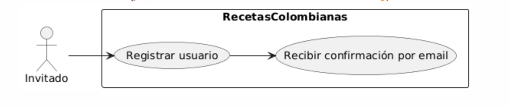
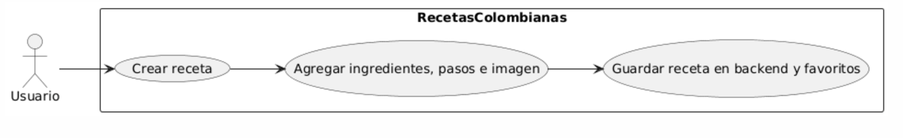

## Casos de Uso
**Fecha:** 2025-09-07  
**Versión:** 1.1  
**Responsables:**  
ANGIE VALENTINA FLOREZ VARGAS  
SERGIO ALEJANDRO MUÑOZ CABRERA  
KARINA CANTILLO PLAZA

A continuación, se detallan los casos de uso del sistema, describiendo las interacciones entre los actores y la aplicación.

#### UC-01: Registrarse

-   **ID**: UC-01
-   **Actor principal**: Invitado / Usuario
-   **Objetivo**: Permitir a un usuario crear una cuenta en la aplicación.
-   **Precondición**: El usuario no está autenticado; conexión a internet disponible.
-   **Postcondición (éxito)**: Usuario creado en la base de datos, email (opcionalmente) verificado; estado listo para el inicio de sesión.
-   **Flujo principal**:
    1.  El invitado selecciona la opción "Registrarse".
    2.  Ingresa correo, contraseña, nombre (opcional) y acepta las políticas.
    3.  El sistema valida el formato y la unicidad del correo.
    4.  El sistema crea el usuario (con contraseña hasheada) y confirma la creación.
-   **Flujos alternos**:
    -   **A1**: Correo ya registrado → el sistema muestra un mensaje de error y ofrece la opción de recuperar la contraseña.
    -   **A2**: Contraseña no cumple la política → el sistema muestra las reglas de la contraseña.
-   **Reglas de negocio**:
    -   La contraseña debe tener al menos 8 caracteres, 1 mayúscula y 1 dígito.
    -   El consentimiento para el tratamiento de datos es obligatorio.
-   **RF asociado**: RF-01
-   **Prioridad**: Must Have
-   **Criterios de aceptación**: El registro con un correo válido se completa en ≤ 2 segundos. El usuario es creado con una contraseña hasheada y verificable.
-   **Notas**: Se debe registrar la IP y la marca temporal para auditoría.

---

#### UC-02: Iniciar sesión

-   **ID**: UC-02
-   **Actor principal**: Usuario
-   **Precondición**: El usuario ya está registrado en la base de datos.
-   **Postcondición**: El usuario tiene una sesión válida (JWT/ticket) y navega a la pantalla de inicio.
-   **Flujo principal**:
    1.  El usuario ingresa su correo y contraseña.
    2.  El sistema valida las credenciales.
    3.  Si las credenciales son válidas, el sistema genera un token y redirige al usuario a la página de inicio.
-   **Flujo alterno**:
    -   **A1**: Credenciales incorrectas → el sistema muestra un mensaje de error.
    -   **A2**: 5 intentos fallidos → el sistema bloquea temporalmente la cuenta y envía una notificación.
-   **RF asociado**: RF-02, RF-03 (para el inicio de sesión con Google)
-   **Prioridad**: Must Have
-   **Criterios de aceptación**: El inicio de sesión se completa en ≤ 1.5 segundos. La cuenta se bloquea temporalmente después de 5 intentos fallidos.

---

#### UC-03: Buscar / Filtrar recetas

-   **ID**: UC-03
-   **Actor**: Invitado / Usuario
-   **Objetivo**: Encontrar recetas por texto, ciudad, categoría o ingredientes.
-   **Flujo principal**:
    1.  El usuario ingresa un término de búsqueda o selecciona un filtro (ciudad/categoría).
    2.  El sistema devuelve una lista paginada de recetas, ordenadas por relevancia o calificación.
-   **Flujo alterno**:
    -   No hay resultados → el sistema muestra sugerencias de búsqueda.
-   **RF asociado**: RF-04, RF-05
-   **Prioridad**: Must Have
-   **Criterios de aceptación**: La respuesta paginada se devuelve en ≤ 800 ms con una conexión normal. La aplicación debe mostrar una caché local si la conexión es parcial.

---

#### UC-04: Ver detalle de receta

-   **ID**: UC-04
-   **Actor**: Invitado / Usuario
-   **Precondición**: La receta existe en la base de datos o en la caché local.
-   **Flujo principal**: El sistema muestra los detalles de la receta: título, autor, ingredientes estructurados, pasos numerados, foto, calificación promedio, y botones para marcar como favorito o comentar.
-   **Flujo alterno**:
    -   Sin conexión y sin caché → el sistema muestra un mensaje de "no disponible sin conexión".
-   **RF asociado**: RF-05
-   **Prioridad**: Must Have

---

#### UC-05: Publicar receta

-   **ID**: UC-05
-   **Actor**: Usuario autenticado
-   **Precondición**: El usuario está autenticado y tiene su perfil confirmado.
-   **Flujo principal**:
    1.  El usuario selecciona “Nueva receta”.
    2.  Rellena los campos: título, ingredientes y pasos (obligatorios), tiempo y foto (opcionales).
    3.  El sistema ejecuta validaciones.
    4.  La receta se guarda con el estado **pendiente**.
    5.  El sistema notifica a los moderadores.
-   **Flujo alterno**:
    -   Si falta un campo obligatorio → el sistema muestra un error de validación en el formulario.
    -   Si el usuario quiere guardar como borrador → Se dispara el UC-05c (caso de uso no detallado).
-   **Reglas de negocio**:
    -   La imagen debe ser de ≤ 2 MB en formatos JPG o PNG.
    -   El sistema debe marcar contenido sospechoso o inapropiado.
-   **RF asociado**: RF-03, RF-11
-   **Prioridad**: Must Have
-   **Criterios de aceptación**: La publicación inicial crea un registro en estado pendiente. La receta solo aparece en los listados una vez aprobada. La notificación al moderador se envía en ≤ 30 segundos.

---

#### UC-06: Marcar/Desmarcar favorito

-   **ID**: UC-06
-   **Actor**: Usuario autenticado
-   **Objetivo**: Permitir al usuario marcar o desmarcar una receta como favorita, con sincronización y acceso sin conexión.
-   **Flujo principal**:
    1.  El usuario pulsa el botón "Favorito".
    2.  El sistema guarda la acción localmente y la pone en cola para sincronizar si no hay conexión a internet.
    3.  En modo offline, los favoritos son accesibles desde la caché local.
-   **RF asociado**: RF-06
-   **Prioridad**: Must Have
-   **Criterios de aceptación**: Los favoritos deben ser visibles sin conexión y sincronizarse automáticamente al recuperar la conexión. La latencia local debe ser de ≤ 100 ms.

---

#### UC-07: Comentar en receta

-   **ID**: UC-07
-   **Actor**: Usuario autenticado
-   **Flujo principal**: El usuario agrega un comentario asociado a una receta. El comentario estará sujeto a moderación posterior si es reportado.
-   **RF asociado**: RF-07
-   **Prioridad**: Should Have

---

#### UC-08: Calificar receta

-   **ID**: UC-08
-   **Actor**: Usuario autenticado
-   **Flujo principal**: El usuario asigna una calificación de 1 a 5 estrellas. El sistema recalcula el promedio de la calificación (local y en el servidor) y lo actualiza.
-   **RF asociado**: RF-07
-   **Prioridad**: Should Have

---

#### UC-09: Reportar receta

-   **ID**: UC-09
-   **Actor**: Usuario autenticado
-   **Flujo principal**: El usuario marca una receta como inapropiada, envía un motivo para el reporte, y esto dispara el proceso de moderación (UC-10).
-   **RF asociado**: RF-08
-   **Prioridad**: Should Have

---

#### UC-10: Moderación: Aprobar/Rechazar receta

-   **ID**: UC-10
-   **Actor**: Moderador / Administrador
-   **Flujo principal**:
    1.  El moderador recibe un aviso sobre una receta pendiente o reportada.
    2.  Revisa el contenido (texto e imágenes).
    3.  Decide si aprobar o rechazar la receta, y opcionalmente añade un motivo.
    4.  El sistema cambia el estado de la receta y notifica al autor.
-   **Reglas de negocio**: Se debe registrar quién aprobó/rechazó la receta y la marca de tiempo para fines de auditoría.
-   **RF asociado**: RF-09, RNF-SEC-02
-   **Prioridad**: Must Have

---

#### UC-11: Editar perfil

-   **ID**: UC-11
-   **Actor**: Usuario autenticado
-   **Descripción**: Permite al usuario cambiar su nombre o foto de perfil. La imagen de la foto de perfil debe ser de ≤ 2 MB.
-   **RF asociado**: RF-10
-   **Prioridad**: Could Have / Should Have (depende del alcance)

---

#### UC-12: Recibir notificaciones

-   **ID**: UC-12
-   **Actor**: Sistema / Usuario
-   **Descripción**: El sistema envía notificaciones al usuario sobre eventos importantes, como la aprobación de una publicación, un nuevo comentario o la resolución de un reporte.
-   **Prioridad**: Could Have
-   **Criterio de aceptación**: Las notificaciones push o locales se entregan en ≤ 10 segundos después de que ocurre el evento.