# Software Requirements Specification (SRS) – App de Recetas “RecetasColombianas”
**Fecha:** 2025-09-07  
**Versión:** 1.1  
**Responsables:**  
ANGIE VALENTINA FLOREZ VARGAS  
SERGIO ALEJANDRO MUÑOZ CABRERA  
KARINA CANTILLO PLAZA

## 1. Introducción

### 1.1 Propósito

Este SRS tiene como objetivo definir de manera clara y verificable los requerimientos funcionales y no funcionales de la aplicación móvil RecetasColombianas, dirigida al equipo de desarrollo y QA.
El documento sirve para:
- Asegurar que todas las funcionalidades se implementen según criterios claros.
- Servir como referencia para diseño, pruebas, validación y mantenimiento.
- Garantizar que los usuarios puedan publicar, explorar, guardar y valorar recetas de manera segura y eficiente.

### 1.2 Alcance

**RecetasColombianas** permitirá a los usuarios:

* Registrar cuentas y autenticarse mediante correo electrónico y contraseña.
* Crear, editar y publicar recetas con título, descripción, ingredientes, pasos, categoría, tags y foto.
* Explorar recetas de otros usuarios y filtrarlas por categoría, dificultad, tiempo de preparación o ingredientes.
* Comentar y valorar recetas.
* Guardar recetas favoritas para visualización offline.

**No incluye**: pagos, integración con tiendas de ingredientes, chat privado entre usuarios ni funciones avanzadas de comunidad (como grupos o foros completos),funcionalidad en iOS o web..

### 1.3 Definiciones, acrónimos y abreviaturas

* **RF**: Requisito Funcional
* **RNF**: Requisito No Funcional
* **API**: Interfaz de Programación de Aplicaciones
* **JSON**: JavaScript Object Notation
* **DoD**: Definition of Done / Definición de Terminado
* **WIP**: Work in Progress

### 1.4 Referencias

* Plantilla IEEE 830 – IEEE Standard for Software Requirements Specification.
* Documentación oficial de Firebase y Room (para almacenamiento de datos).
* Documentación oficial de Kotlin y Android Jetpack

### 1.5 Visión general del documento

* **Sección 2**: Descripción general del sistema.
* **Sección 3**: Requerimientos específicos (RF, RNF, interfaces, datos).
* **Sección 4**: Casos de uso y criterios de aceptación.
* **Sección 5**: Apéndices (mockups, DER simplificado).

---

## 2. Descripción general

### 2.1 Perspectiva del producto

RecetasColombianas es una **app móvil nativa** para Android, que interactúa con un backend mediante **API REST**.

* Frontend: React + Ionic React

* Backend: Node.js  (TypeScript)

* Base de datos: MySQL. 

### 2.2 Funciones del producto**

1. Registro y autenticación de usuarios.
2. Crear y eliminar recetas.
3. Explorar y buscar recetas por título, ingredientes, categoría o tags.
4. Guardar recetas favoritas offline.
5. Comentar y valorar recetas.
6. Visualización de recetas con ingredientes, pasos, tiempos, dificultad y fotos.

**Reglas de negocio:**

- Todo usuario registrado puede publicar recetas.
- Cada receta debe contener título, ingredientes y pasos; fotos y tags son opcionales.
- Imágenes ≤ 5 MB, formatos JPG/PNG.
- Favoritos disponibles offline.
- Contenido inapropiado será bloqueado.

### 2.3 Características de los usuarios

* Usuarios comunes: alfabetización digital básica; interesados en cocinar y compartir recetas.
* Administradores (opcional): gestión de reportes de contenido.

### 2.4 Restricciones

- Solo Android (≥10).
- Conexión a Internet requerida para sincronización; favoritos disponibles offline.
- Cumplimiento de políticas de privacidad.
- Requisitos mínimos: 2 GB RAM.
- Imágenes ≤5 MB, JPG/PNG.

### 2.5 Supuestos y dependencias

- Servicios de almacenamiento remoto disponibles (Firebase/backend).
- Conexión eventual a Internet para sincronización.
- APIs externas opcionales para imágenes o sugerencias de recetas.

---

## 3. Requerimientos específicos

### 3.1 Interfaces externas

* **UI**: Pantallas de registro/login, exploración de recetas, detalle de receta, favoritos, perfil.
* **API**:

  * GET `/recipes?limit=20&category=PlatoFuerte` → Lista de recetas JSON.
  * POST `/recipes` → Crear receta con datos JSON.
  * GET `/recipes/{id}` → Obtener detalle de receta.

### **3.2 Funciones del sistema (RF)**

* **RF-01: Registro y autenticación de usuarios**
  - **Prioridad:** Alta
  - **Criterio de aceptación:** Usuarios se registran con email y contraseña ≥8 caracteres, y reciben confirmación de registro.

* **RF-02: Crear receta**
  - **Prioridad:** Alta
  - **Criterio de aceptación:** Usuarios crean recetas con título, ingredientes y pasos; se guarda en backend y local si se marca como favorito.

* **RF-03: Editar receta**
  - **Prioridad:** Media
  - **Criterio de aceptación:** Usuarios pueden modificar recetas propias; los cambios se reflejan en backend y en favoritos offline.

* **RF-04: Eliminar receta**
  - **Prioridad:** Media
  - **Criterio de aceptación:** Usuarios eliminan recetas propias; se borra del backend y de favoritos.

* **RF-05: Buscar y explorar recetas**
  - **Prioridad:** Alta
  - **Criterio de aceptación:** Usuarios buscan por título, ingredientes, categoría o tags; se muestran resultados relevantes.

* **RF-06: Guardar favoritos offline**
  - **Prioridad:** Alta
  - **Criterio de aceptación:** Selección de receta como favorita disponible sin conexión.

* **RF-07: Comentar receta**
  - **Prioridad:** Media
  - **Criterio de aceptación:** Usuarios agregan comentarios; visibles en la receta y sincronizados con backend.

* **RF-08: Valorar receta**
  - **Prioridad:** Media
  - **Criterio de aceptación:** Usuarios califican recetas (1-5 estrellas); la calificación refleja el promedio en backend y app.

---

### 3.3 Requerimientos no funcionales (RNF)

| ID     | Descripción                                            |
| ------ | ------------------------------------------------------ |
| RNF-01 | Tiempo de carga inicial ≤ 3 s                          |
| RNF-02 | Listado de recetas ≤ 1 s                               |
| RNF-03 | App disponible 99% uptime                              |
| RNF-04 | Credenciales cifradas y transmisión vía TLS 1.2+       |
| RNF-05 | Compatibilidad con lectores de pantalla y contraste AA |

### 3.4 Lógica de datos / base de datos

**Entidades principales:**

1. Tabla User (user_id, name, username, email, password, profile_picture, bio, role, created_at, updated_at)
2. Tabla Recipe (recipe_id, title, description, ingredients, steps, prep_time, cook_time, servings, difficulty, image_url, created_at, created_at, updated_at, category, tags)
3. Tabla Favorite (favorite_id, user_id, recipe_id, created_at)
4. Tabla Comment (comment_id, user_id, recipe_id, content, created_at, parent_comment_id)
5. Tabla Rating (rating_id, user_id, recipe_id, score, created_at)
6. Tabla Report (report_id, user_id, recipe_id, reason, status, created_at)

**Entidades y relaciones**

| Relación                   | Entidades involucradas                          | Cardinalidad | Comentario                                                               |
| -------------------------- | ----------------------------------------------- | ------------ | ------------------------------------------------------------------------ |
| `User → Recipe`            | Un usuario publica muchas recetas               | 1\:N         | `created_by` en Recipe es FK → User                                      |
| `User → Favorite → Recipe` | Un usuario puede tener muchas recetas favoritas | N\:M         | Implementada con tabla Favorite                                          |
| `User → Comment → Recipe`  | Un usuario puede comentar muchas recetas        | 1\:N         | `user_id` en Comment es FK → User; `recipe_id` en Comment es FK → Recipe |
| `Comment → Comment`        | Comentarios pueden tener respuestas             | 1\:N         | `parent_comment_id` referencia `comment_id`                              |
| `User → Rating → Recipe`   | Un usuario puede calificar muchas recetas       | N\:M         | Implementada con tabla Rating                                            |
| `User → Report → Recipe`   | Un usuario puede reportar muchas recetas        | 1\:N         | `user_id` y `recipe_id` en Report como FKs                               |

### **3.5 Restricciones de diseño**

* App nativa Android solo.
* Material Design y responsive para diferentes tamaños de pantalla.
* SDK mínimo: Android 10.

### **3.6 Atributos del sistema**

* **Seguridad**: credenciales cifradas, TLS 1.2+, bloqueo tras 5 intentos fallidos
* **Disponibilidad**: 99% uptime
* **Mantenibilidad**: código modular y documentado
* **Portabilidad**: compatible Android
* **Accesibilidad**: soporte para lectores de pantalla, targets ≥44x44 px

### **3.7 Internacionalización/localización**

* Idioma principal: español
* Posible extensión a inglés
---

## **4. Apéndices**

* **Mockups iniciales:**

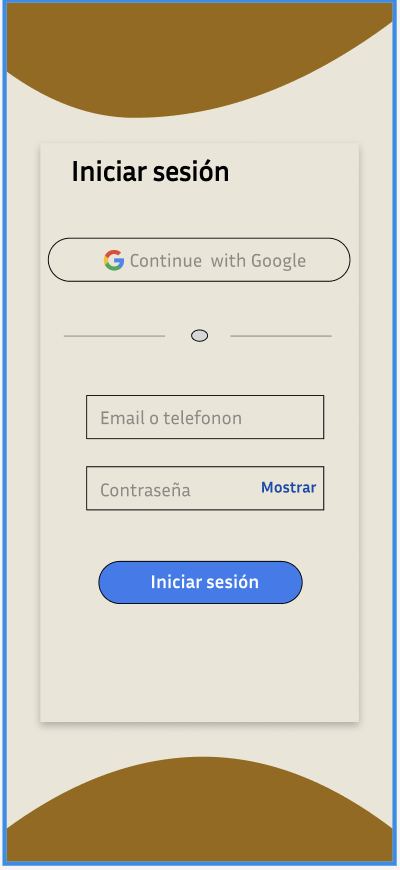
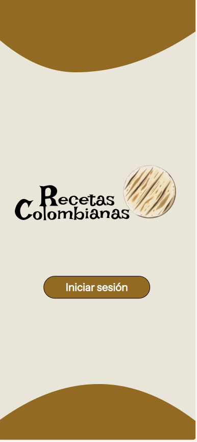
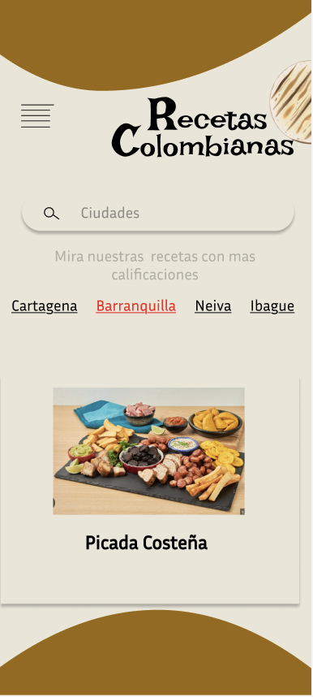
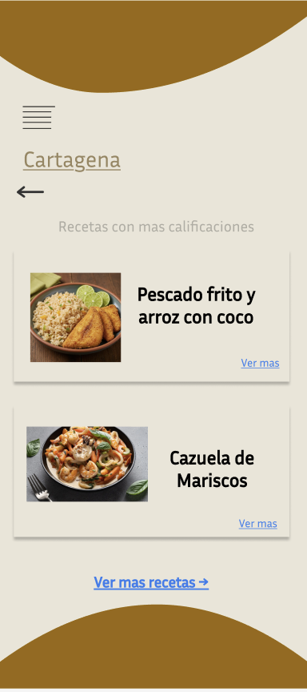
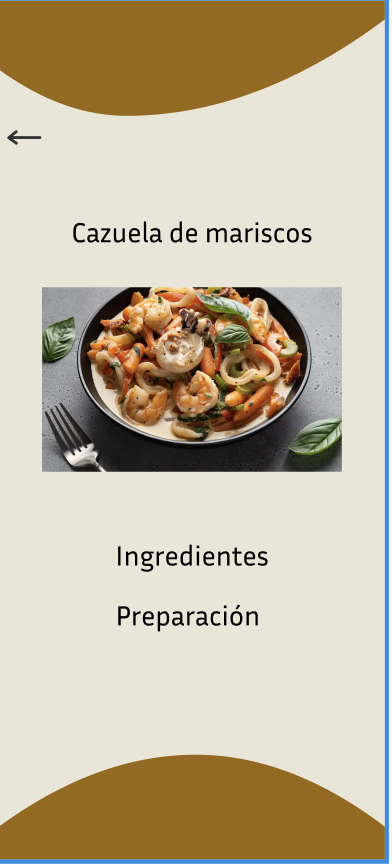
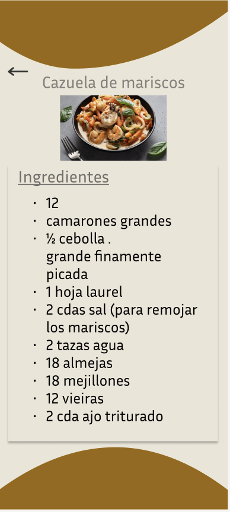
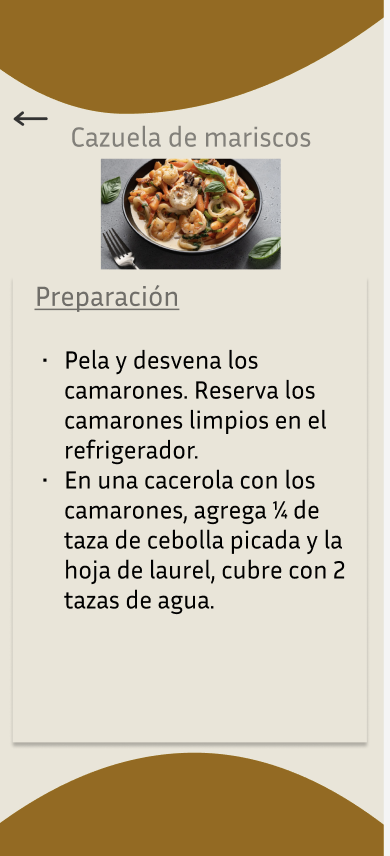
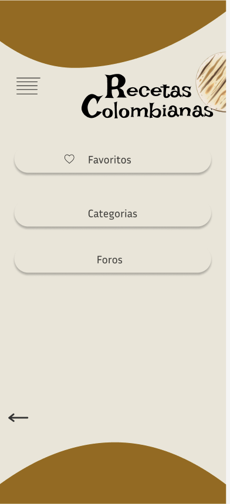
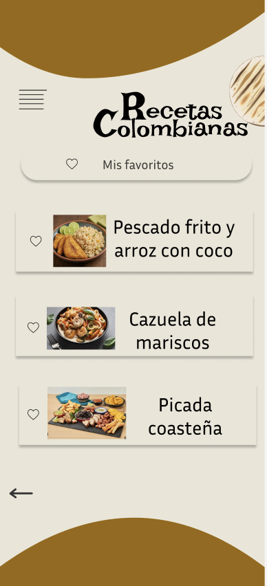
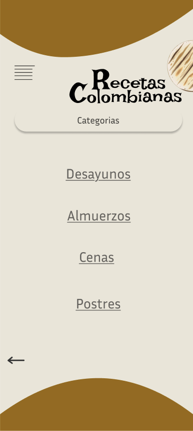
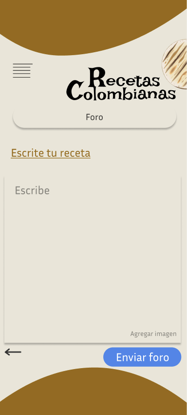

* **DER simplificado:** (Ver sección 3.4)

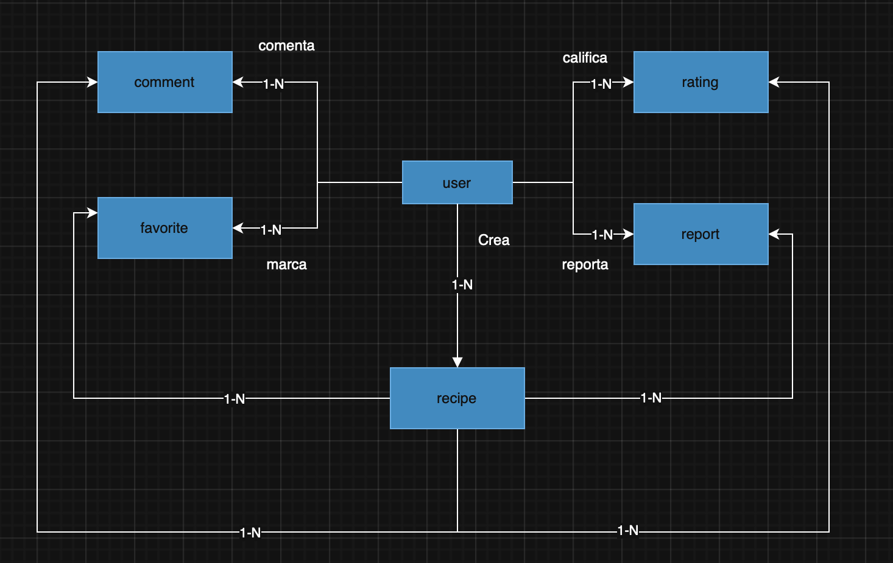

* **Ejemplo de receta JSON:** Pasta Alfredo, Tacos de Pollo al Pastor

{
  "recipe_id": 1,
  "title": "Pasta Alfredo",
  "description": "Una receta clásica italiana de pasta con salsa cremosa de queso parmesano.",
  "ingredients": [
    {"name": "Pasta fettuccine", "quantity": 250, "unit": "g"},
    {"name": "Mantequilla", "quantity": 50, "unit": "g"},
    {"name": "Crema de leche", "quantity": 200, "unit": "ml"},
    {"name": "Queso parmesano rallado", "quantity": 100, "unit": "g"},
    {"name": "Sal", "quantity": 1, "unit": "cucharadita"},
    {"name": "Pimienta negra", "quantity": 0.5, "unit": "cucharadita"}
  ],
  "steps": [
    "Cocinar la pasta según instrucciones.",
    "Derretir mantequilla en sartén a fuego medio.",
    "Agregar crema de leche y cocinar 5 minutos.",
    "Añadir queso parmesano, sal y pimienta, mezclar bien.",
    "Incorporar la pasta cocida, mezclar y servir caliente."
  ],
  "prep_time": 10,
  "cook_time": 15,
  "servings": 2,
  "difficulty": "Fácil",
  "image_url": "https://example.com/images/pasta_alfredo.jpg",
  "created_by": 101,
  "created_at": "2025-09-08T10:00:00Z",
  "category": "Plato fuerte",
  "tags": ["pasta", "italiana", "cremosa"]
}

