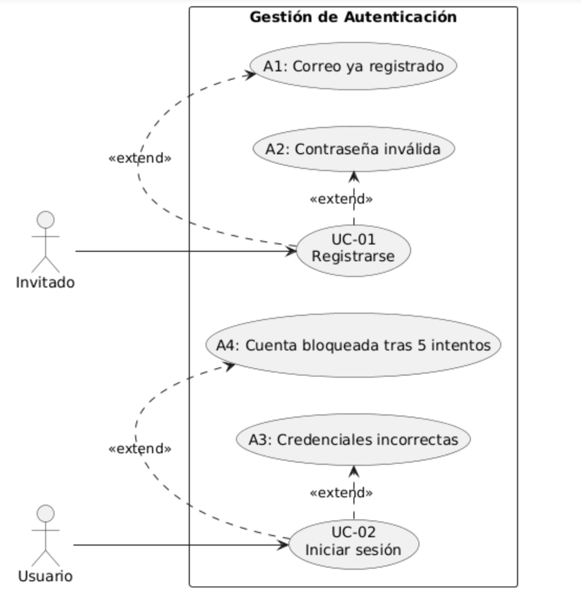
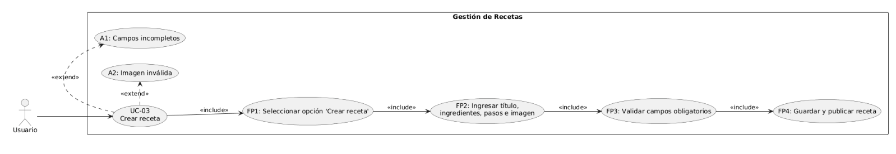
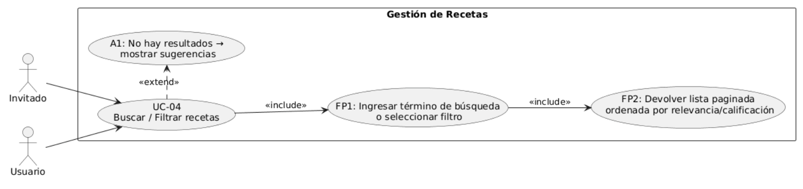
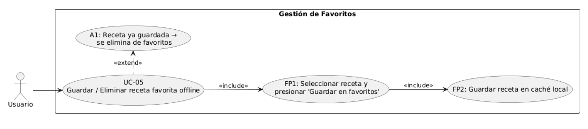
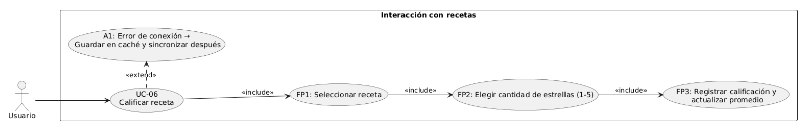
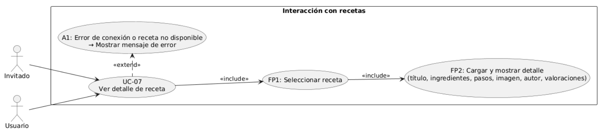
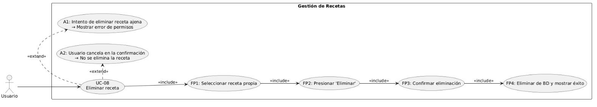

# RECETAS COLOMBIANAS

## tema 3: Requerimientos y casos de uso

### Identificación de requerimientos.

 - REQUERIMIENTOS FUNCIONALES

| ID        | Descripción                          | Prioridad | Criterio de aceptación                                                                              |
| --------- | ------------------------------------ | --------- | --------------------------------------------------------------------------------------------------- |
| **RF-01** | Registro y autenticación de usuarios | Alta      | Usuarios se registran con email y contraseña ≥8 caracteres, y reciben confirmación de registro.     |
| **RF-02** | Crear receta                         | Alta      | Usuarios crean recetas con título, ingredientes, pasos e imagen; la receta se guarda en el backend. |
| **RF-03** | Buscar y explorar recetas            | Alta      | Usuarios buscan por título, ingredientes o ciudad; se muestran resultados relevantes.               |
| **RF-04** | Guardar recetas favoritas offline    | Alta      | Selección de una receta como favorita disponible sin conexión.                                      |
| **RF-05** | Valorar receta                       | Media     | Usuarios califican recetas (1–5 estrellas); la app muestra promedio actualizado.                    |
| **RF-06** | Visualizar detalle de receta         | Alta      | Usuarios ven ingredientes, pasos, dificultad, tiempo, autor e imagen en la vista de detalle.        |
| **RF-07** | Eliminar receta                      | Media     | Usuarios eliminan recetas propias; se borra del backend y de favoritos offline.                     | 

 - REQUERIMIENTOS NO FUNCIONALES

 | ID         | Descripción                                                                       |
| ---------- | --------------------------------------------------------------------------------- |
| **RNF-01** | Tiempo de carga inicial ≤ 3 s (fluidez al abrir la app).                          |
| **RNF-02** | Listado de recetas ≤ 1 s (optimización de búsqueda y exploración).                |
| **RNF-03** | Disponibilidad ≥ 99% uptime (la app debe estar estable y accesible).              |
| **RNF-04** | Seguridad: credenciales cifradas y transmisión vía TLS 1.2+.                      |
| **RNF-05** | Accesibilidad: compatibilidad con lectores de pantalla y contraste mínimo **AA**. |

### levantamiento de requerimientos 

# Levantamiento de Requerimientos

Para la definición de los requerimientos de la **App de Recetas Colombianas**, se aplicaron dos técnicas:  
1. **Entrevistas semiestructuradas**  
2. **Encuestas en línea**  

Estas técnicas permitieron obtener tanto **información cualitativa** (percepciones, frustraciones, expectativas) como **cuantitativa** (datos estadísticos) de usuarios reales y potenciales.  

---

## Entrevistas Semiestructuradas  

👉 **Población entrevistada:**  
- 3 estudiantes universitarios (18–24 años)  
- 2 amas de casa (35–45 años)  
- 2 jóvenes profesionales (25–30 años)  

👉 **Objetivo:** Explorar hábitos, dificultades y expectativas sobre el uso de recetas digitales.  

👉 **Ejemplos de preguntas:**  
1. ¿Cómo buscas actualmente recetas para cocinar (apps, internet, familiares)?  
2. ¿Qué dificultades sueles encontrar al seguir una receta en internet?  
3. ¿Qué funcionalidades te gustaría que tuviera una app de recetas colombianas?  
4. ¿Guardarías tus recetas favoritas en el celular para usarlas sin internet?  
5. ¿Qué tan importante es para ti ver fotos y pasos detallados en las recetas?  

👉 **Principales hallazgos:**  
- Los estudiantes manifestaron que pierden tiempo buscando recetas dispersas en internet.  
- Las amas de casa expresaron la necesidad de **recetas auténticas y organizadas paso a paso**.  
- Los jóvenes profesionales destacaron la importancia de **buscar por ingredientes y ciudad** para preparar platos locales.  
- Todos coincidieron en la importancia de **guardar recetas offline**.  

Estos hallazgos se relacionan directamente con las HU-01, HU-03, HU-04, HU-05 y HU-06.  

---

## Encuestas en línea  

👉 **Población encuestada:** 80 personas (WhatsApp, redes sociales y grupos de cocina).  
👉 **Objetivo:** Validar las funcionalidades priorizadas en las HU.  

👉 **Ejemplos de preguntas:**  
1. ¿Con qué frecuencia buscas recetas de cocina?  
   - Todos los días → 25%  
   - Varias veces a la semana → 45%  
   - Ocasionalmente → 30%  

2. ¿Qué tipo de platos buscas más?  
   - Desayunos y cenas → 20%  
   - Almuerzos → 30%  
   - Postres → 15%  
   - Platos típicos por ciudad → 35%  

3. ¿Qué funcionalidad valorarías más en una app de recetas?  
   - Búsqueda por ingredientes → 25%  
   - Guardar recetas favoritas offline → 30%  
   - Publicar mis propias recetas → 15%  
   - Valoraciones de la comunidad → 10%  
   - Búsqueda por ciudad → 20%  

4. ¿Qué dispositivo usas principalmente para cocinar con recetas digitales?  
   - Celular → 70%  
   - Tablet → 20%  
   - Computador → 10%  

5. Si existiera una app de recetas colombianas, ¿qué tan probable sería que la uses?  
   - Muy probable (4–5) → 80%  
   - Medianamente probable (3) → 15%  
   - Poco probable (1–2) → 5%  

---

## Resultados combinados y alineados con HU  

- **HU-01 / HU-02 Registro e inicio de sesión:** El 80% declaró que usaría la app con frecuencia → Necesidad confirmada.  
- **HU-03 Publicar recetas:** Validado por el 15% que quiere compartir, aunque no es la prioridad → Se mantiene como Media.  
- **HU-04 Ver recetas y HU-05 Buscar por ciudad:** El 35% busca recetas típicas → Prioridad Alta.  
- **HU-06 Guardar favoritos offline:** El 30% lo considera esencial → Se confirma como Must Have.  
- **HU-07 Valorar recetas:** 10% la pidió → Se clasifica como Media.  
- **HU-08 a HU-11 (Won’t Have):** No fueron prioridad en las entrevistas ni encuestas → se descartan en esta versión inicial.  

---

## Conclusión del levantamiento  

El uso combinado de **entrevista + encuesta** permitió:  
- Identificar **necesidades clave** (registro, búsqueda por ciudad, favoritos offline).  
- Validar **prioridades de desarrollo** con datos cuantitativos.  
- Confirmar que las HU definidas reflejan **demandas reales de los usuarios**.  

Esto garantiza que los **requerimientos funcionales (RF)** y **no funcionales (RNF)** estén alineados con el valor esperado por los usuarios.

### CREACION DE CASOS DE USO 

---
## Casos de Uso del Sistema de Recetas

### **UC-01: Registrarse**
* **ID:** UC-01
* **Actor principal:** Invitado / Usuario
* **Objetivo:** Permitir a un usuario crear una cuenta en la aplicación.
* **Precondición:** El usuario no está autenticado; conexión a internet disponible.
* **Postcondición (éxito):** Usuario creado en la base de datos, email (opcionalmente) verificado; estado listo para el inicio de sesión.
* **Flujo principal:**
    1.  El invitado selecciona la opción **"Registrarse"**.
    2.  Ingresa correo, contraseña, nombre (opcional) y acepta las políticas.
    3.  El sistema valida el formato y la unicidad del correo.
    4.  El sistema crea el usuario (con contraseña hasheada) y confirma la creación.
* **Flujos alternos:**
    * **A1: Correo ya registrado** → El sistema muestra un mensaje de error y ofrece la opción de recuperar la contraseña.
    * **A2: Contraseña no cumple la política** → El sistema muestra las reglas de la contraseña.
* **Reglas de negocio:** La contraseña debe tener al menos 8 caracteres, 1 mayúscula y 1 dígito. El consentimiento para el tratamiento de datos es obligatorio.
* **RF asociado:** RF-01
* **Prioridad:** Must Have
* **Criterios de aceptación:** El registro con un correo válido se completa en ≤ 2 segundos. El usuario es creado con una contraseña hasheada y verificable.
* **Notas:** Se debe registrar la IP y la marca temporal para auditoría.

---

### **UC-02: Iniciar sesión**
* **ID:** UC-02
* **Actor principal:** Usuario
* **Objetivo:** Permitir que un usuario acceda con sus credenciales.
* **Precondición:** El usuario ya está registrado en la base de datos.
* **Postcondición (éxito):** El usuario tiene una sesión válida (JWT/ticket) y navega a la pantalla de inicio.
* **Flujo principal:**
    1.  El usuario ingresa su correo y contraseña.
    2.  El sistema valida las credenciales.
    3.  Si las credenciales son válidas, el sistema genera un token y redirige al usuario a la página de inicio.
* **Flujos alternos:**
    * **A1: Credenciales incorrectas** → El sistema muestra un mensaje de error.
    * **A2: 5 intentos fallidos** → El sistema bloquea temporalmente la cuenta y envía una notificación.
* **RF asociado:** RF-01
* **Prioridad:** Must Have
* **Criterios de aceptación:** El inicio de sesión se completa en ≤ 1.5 segundos. La cuenta se bloquea temporalmente después de 5 intentos fallidos.

---

### **UC-03: Crear receta**
* **ID:** UC-03
* **Actor principal:** Usuario autenticado
* **Objetivo:** Permitir a un usuario publicar una receta con título, ingredientes, pasos e imagen.
* **Precondición:** Usuario autenticado.
* **Postcondición (éxito):** Receta publicada en el sistema.
* **Flujo principal:**
    1.  El usuario selecciona la opción **"Crear receta"**.
    2.  Ingresa título, ingredientes, pasos e imagen.
    3.  El sistema valida los campos obligatorios.
    4.  El sistema guarda la receta y la publica.
* **Flujos alternos:**
    * **A1: Campos incompletos** → Se muestra un mensaje de error.
    * **A2: Imagen inválida** → Se muestra un mensaje de error.
* **RF asociado:** RF-02
* **Prioridad:** Must Have
* **Criterios de aceptación:** La receta válida se publica en ≤ 2 segundos.

---

### **UC-04: Buscar / Filtrar recetas**
* **ID:** UC-04
* **Actor principal:** Invitado / Usuario
* **Objetivo:** Encontrar recetas por texto, ciudad, categoría o ingredientes.
* **Precondición:** Conexión activa o caché disponible.
* **Postcondición (éxito):** Lista paginada de recetas mostrada.
* **Flujo principal:**
    1.  El usuario ingresa un término de búsqueda o selecciona un filtro.
    2.  El sistema devuelve una lista paginada de recetas, ordenadas por relevancia o calificación.
* **Flujos alternos:**
    * **A1: No hay resultados** → El sistema muestra sugerencias.
* **RF asociado:** RF-05
* **Prioridad:** Must Have
* **Criterios de aceptación:** La respuesta paginada se devuelve en ≤ 800 ms.

---

### **UC-05: Guardar / Eliminar receta favorita offline**
* **ID:** UC-05
* **Actor principal:** Usuario autenticado
* **Objetivo:** Permitir guardar o eliminar una receta en favoritos para consulta offline.
* **Precondición:** Usuario autenticado.
* **Postcondición (éxito):** La receta queda marcada o desmarcada como favorita en caché local.
* **Flujo principal:**
    1.  El usuario selecciona una receta y presiona **"Guardar en favoritos"**.
    2.  El sistema guarda la receta en caché local.
    3.  Si ya está guardada y la selecciona nuevamente, se elimina de favoritos.
* **RF asociado:** RF-06
* **Prioridad:** Should Have
* **Criterios de aceptación:** Guardar/eliminar favorito se completa en ≤ 500 ms.

---

### **UC-06: Calificar receta**
* **ID:** UC-06
* **Actor principal:** Usuario autenticado
* **Objetivo:** Permitir calificar una receta con estrellas (1 a 5).
* **Precondición:** Usuario autenticado; receta existente.
* **Postcondición (éxito):** La calificación se almacena y actualiza el promedio.
* **Flujo principal:**
    1.  El usuario selecciona una receta.
    2.  Elige la cantidad de estrellas (1–5).
    3.  El sistema registra la calificación y actualiza el promedio visible.
* **Flujos alternos:**
    * **A1: Error de conexión** → El sistema guarda la calificación en caché y la sincroniza después.
* **RF asociado:** RF-08
* **Prioridad:** Must Have
* **Criterios de aceptación:** La calificación se refleja en ≤ 1 segundo.
 
---

### **UC-07: Ver detalle de receta**
* **ID:** UC-07
* **Actor principal:** Invitado / Usuario
* **Objetivo:** Visualizar la información completa de una receta.
* **Precondición:** La receta existe.
* **Postcondición (éxito):** La receta se muestra con título, ingredientes, pasos, imagen, autor y valoraciones.
* **Flujo principal:**
    1.  El usuario selecciona una receta.
    2.  El sistema carga y muestra el detalle de la receta.
* **RF asociado:** RF-09
* **Prioridad:** Must Have
* **Criterios de aceptación:** El detalle se carga en ≤ 1 segundo.

 
---

### **UC-08: Eliminar receta**
* **ID:** UC-08
* **Actor principal:** Usuario autenticado (autor de la receta)
* **Objetivo:** Permitir al autor eliminar su propia receta.
* **Precondición:** Usuario autenticado; receta creada previamente por él.
* **Postcondición (éxito):** Receta eliminada de la base de datos y no visible para otros usuarios.
* **Flujo principal:**
    1.  El usuario selecciona una de sus recetas.
    2.  Presiona la opción **"Eliminar"**.
    3.  El sistema solicita confirmación.
    4.  El usuario confirma la eliminación.
    5.  El sistema elimina la receta y muestra un mensaje de éxito.
* **Flujos alternos:**
    * **A1: Usuario intenta eliminar una receta que no es suya** → El sistema muestra un error de permisos.
    * **A2: El usuario cancela en la confirmación** → No se elimina la receta.
* **RF asociado:** RF-10 (Eliminar receta)
* **Prioridad:** Should Have
* **Criterios de aceptación:** La eliminación se refleja en ≤ 1 segundo y la receta ya no es accesible desde ninguna vista.
 

### PRIORIZACION MOSCOW

| **ID**    | **Descripción**                      | **MoSCoW**      | **Justificación**                                                                    |
| --------- | ------------------------------------ | --------------- | ------------------------------------------------------------------------------------ |
| **RF-01** | Registro y autenticación de usuarios | **Must Have**   | Esencial para acceder a la aplicación; sin esto no hay usuarios autenticados.        |
| **RF-02** | Crear receta                         | **Must Have**   | Core de la aplicación, sin esta función no hay contenido.                            |
| **RF-03** | Buscar y explorar recetas            | **Must Have**   | Clave para que los usuarios encuentren recetas fácilmente.                           |
| **RF-04** | Guardar recetas favoritas offline    | **Should Have** | Aporta valor y mejora la experiencia, pero no es crítico en la primera versión.      |
| **RF-05** | Valorar receta                       | **Should Have** | Fomenta la interacción de la comunidad, pero puede implementarse después del MVP.    |
| **RF-06** | Visualizar detalle de receta         | **Must Have**   | Necesario para ver información completa de cada receta.                              |
| **RF-07** | Eliminar receta                      | **Should Have** | Importante para la gestión del usuario, pero no bloquea el funcionamiento principal. |
