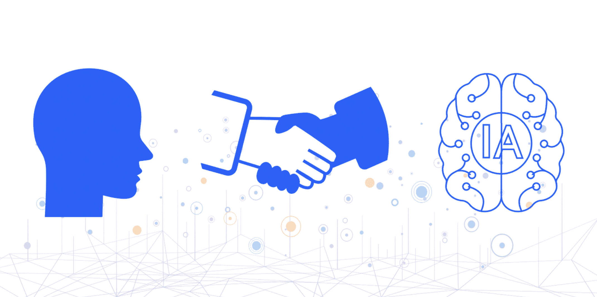
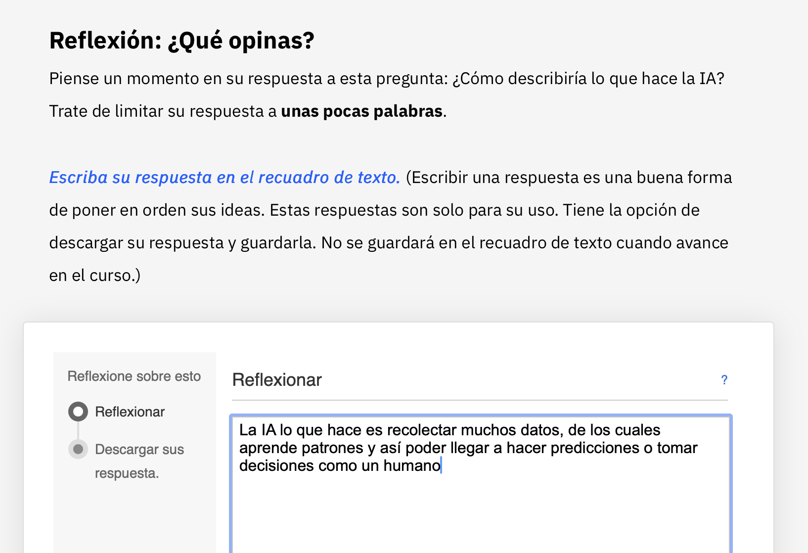
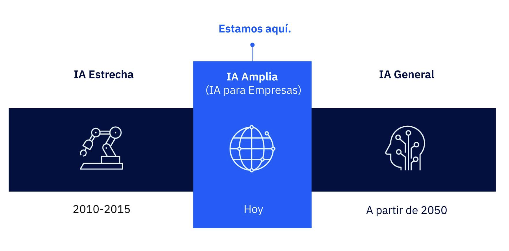
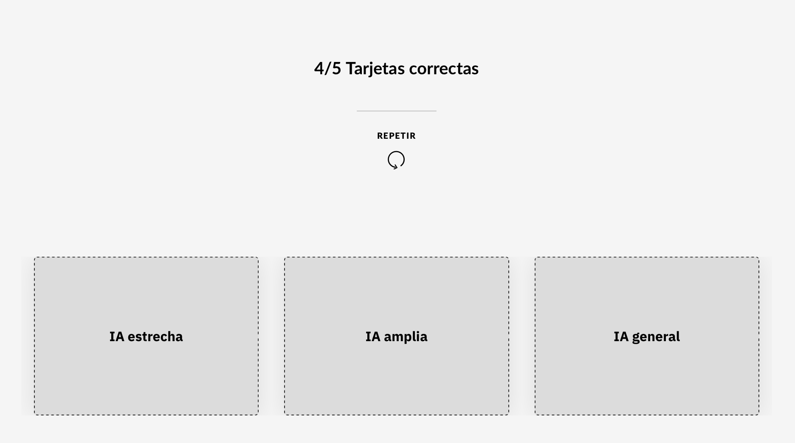

# INTRODUCCION A LA INTELIGENCIA ARTIFICIAL
## Módulo 1 ¿Qué es la inteligencia artificial?

### ¿Qué es IA?

El término inteligencia artificial (IA) se refiere a la capacidad de una máquina para aprender patrones y hacer predicciones. La IA no sustituye a las decisiones humanas, sino que añade valor al juicio humano. 

En su forma más simple, la inteligencia artificial es un campo que combina la informática y sólidos conjuntos de datos para resolver problemas.

### ¿Qué diferencia hay entre IA e inteligencia aumentada?

La inteligencia artificial (IA) busca imitar el pensamiento y procesos humanos, mientras que la inteligencia aumentada (IAu) se centra en apoyar a las personas en tareas que no pueden realizar solas, como procesar grandes volúmenes de información rápidamente. Hoy en día, la IA aún no es lo bastante madura para actuar de forma totalmente autónoma, por ejemplo en diagnósticos médicos.

### ¿Qué hace la IA?

Las máquinas de inteligencia artificial (IA) no piensan, sino que realizan cálculos muy avanzados. Algunas utilizan aprendizaje automático (machine learning), que consiste en entrenarlas con grandes cantidades de datos para que mejoren su rendimiento, mientras que otras emplean aprendizaje profundo (deep learning), que se inspira en el cerebro humano y aprende automáticamente a partir de datos no procesados mediante redes neuronales.

Un ejemplo es la clasificación de carnes en un supermercado:

- Con IA básica, se programan reglas (if-else) que separan pollo, ternera o cerdo según la etiqueta.

- Con aprendizaje automático, la máquina se entrena con muchos ejemplos para reconocer características como tamaño, forma o color, reduciendo errores.

- Con aprendizaje profundo, no hace falta definir características: el modelo aprende solo a partir de fotos y organiza los productos en categorías automáticamente.

### ¿Cómo está evolucionando la IA?

Los informáticos han identificado **tres niveles de IA** basados en su capacidad de **analizar datos y hacer predicciones**:

1. **IA Estrecha**  
   - Se centra en una sola tarea específica.  
   - Ejemplos: Siri, motor de recomendaciones de Amazon, asistentes de voz, vehículos autónomos.  
   - Está muy extendida en el consumo porque hay abundancia de datos para entrenar sistemas en tareas concretas.  
   - Funciona bien dentro de un guion o escenario limitado.  

2. **IA Amplia**  
   - Intermedia entre la estrecha y la general.  
   - Más versátil, capaz de manejar **varias tareas relacionadas**.  
   - Se integra en procesos empresariales y requiere datos específicos del negocio.  
   - Ejemplos de aplicación: predicción del clima, seguimiento de pandemias, análisis de tendencias empresariales.  
   - Actualmente es la más usada en el ámbito empresarial.  

3. **IA General**  
   - El nivel más avanzado (todavía en desarrollo, previsto hacia 2050 o más adelante).  
   - Podría realizar **cualquier tarea intelectual** que haga un humano.  
   - Sería capaz de pensar de forma abstracta, elaborar estrategias, generar ideas creativas y responder con emociones.  
   - Hoy en día no existe, pero se estudia como el futuro de la IA.  

#### Posible Cuarto Nivel: Superinteligencia Artificial (SIA)

- Futuro hipotético hacia finales de este siglo.  
- Máquinas **conscientes de sí mismas**.  
- No se espera que sustituyan a los humanos, sino que amplíen su capacidad para una vida más enriquecedora.  

#### Reflexión de Ray Kurzweil

> "Nuestra tecnología, nuestras máquinas, forman parte de nuestra humanidad.  
> Las creamos para extendernos y eso es lo que hace únicos a los seres humanos."  
> — *Ray Kurzweil, Forbes Magazine*

## Modulo 2 ¿Cuáles son las tres eras de la informática?

### La era de la tabulación

Durante siglos, los humanos han intentado dar sentido a grandes volúmenes de datos, pero extraer información útil de ellos no siempre es sencillo. Los científicos llaman a estos datos sin organizar datos oscuros o no estructurados.
Para manejarlos, a lo largo de la historia se inventaron distintas máquinas:

- Ábaco (China, hace más de 2.000 años): usado por recaudadores de impuestos para clasificar y calcular ingresos.
- Máquina diferencial (Charles Babbage y Ada Lovelace, siglo XIX): pensada para cálculos complejos como tablas de mareas y navegación.
- Tarjetas perforadas (Herman Hollerith, 1880s): permitieron registrar datos de forma más rápida, usadas en el censo de EE. UU. de 1890 y luego en negocios.

La idea central era tabular, es decir, ordenar y estructurar los datos para descubrir patrones y significados.
Este periodo de avances es conocido como la Era de la Tabulación, donde las máquinas ayudaban a los humanos a organizar la información para revelar su valor.

## Módulo 3. Datos estructurados, semiestructurados o no estructurados: ¿en qué se diferencian?

Los datos son información en bruto y pueden ser números, textos, imágenes, sonidos, etc. Se dividen en tres tipos:

- Estructurados → organizados en filas y columnas, fáciles de procesar. Ejemplos: nombres, fechas, direcciones, números de tarjetas.
- No estructurados (datos oscuros) → cualitativos, sin organización clara, difíciles de analizar. Ejemplos: imágenes, comentarios, historiales médicos, canciones.
- Semiestructurados → puente entre ambos, combinan características y usan metadatos para ser catalogados. Ejemplo: un video con hashtags o descripciones.
Hoy en día, los datos no estructurados están cobrando gran relevancia: el 95 % de las empresas priorizan su gestión.

## Módulo 4 ¿Es el aprendizaje automático la respuesta al problema de los datos no estructurados?

### Resolución de Problemas con Datos Oscuros

Los **datos oscuros** son información no estructurada que los sistemas tradicionales no pueden procesar fácilmente. Existen dos enfoques para resolver problemas basados en este tipo de datos:

1. **Ordenador Programable**
- Requiere **una base de datos estructurada** con todas las rutas posibles y datos adicionales (clima, tráfico, accidentes).
- Los datos deben **actualizarse constantemente**, lo que consume muchos recursos.
- El proceso de búsqueda de una ruta óptima es **lento y costoso** en términos de tiempo y capacidad computacional.

2. **IA con Aprendizaje Automático**
- En lugar de depender de una base de datos completa, el sistema **aprende mediante ensayo y error**, probando diferentes rutas como si escalara un árbol.
- Puede **adaptarse rápidamente** a los cambios en el tráfico o condiciones externas.
- Realiza **millones de pequeños cálculos** para optimizar resultados en menos tiempo.

### Ventajas del Aprendizaje Automático
- **No necesita** almacenar todas las rutas posibles.
- **Responde en tiempo real** ante problemas de tráfico.
- **Predice** qué ruta será más rápida según la situación actual.
- **Aprende y mejora** continuamente a partir de la experiencia (por ejemplo, detectando desvíos y ajustando sus recomendaciones).

### El Aprendizaje Automático y el Cálculo Probabilístico

Existen dos formas principales de abordar problemas complejos:

###  Sistema Determinista
- Funciona con una **base de datos estructurada** que contiene todas las rutas o respuestas posibles.  
- Cada opción se evalúa como **“Sí” o “No”**, verdadero o falso.  
- Representa un pensamiento **binario**: encendido/apagado, correcto/incorrecto.  
- Es el método tradicional de los **programas informáticos clásicos**.

###  Sistema de Aprendizaje Automático (Probabilístico)
- No dice simplemente “sí” o “no”, sino que trabaja con **niveles de confianza**.  
- Analiza **todas las rutas posibles** en tiempo real, considerando variables cambiantes (como tráfico o clima).  
- Su pensamiento es **analógico**, no binario:  
  > “Estoy un 84 % seguro de que esta ruta será la más rápida.”  
- Es el mismo principio que usan los **sistemas GPS modernos**, que ofrecen varias rutas con tiempos estimados.

---
### Decisiones Basadas en Probabilidades

El aprendizaje automático no ofrece certezas absolutas, sino **probabilidades**.  
Esto plantea preguntas éticas y personales, por ejemplo:

> ¿Preferiría seguir el tratamiento que su médico recomienda o aquel que una IA considera con mayor probabilidad de éxito?

Este tipo de dilemas muestran cómo las decisiones más importantes deben considerar tanto **el análisis humano** como **las recomendaciones de la IA**.

### Colaboración entre Humanos e Inteligencia Artificial

- Los **humanos** destacan en la **imaginación**, la **empatía** y el **sentido común**.  
- La **IA** sobresale en el **análisis de patrones**, la **precisión** y el **procesamiento de grandes volúmenes de datos**.

La combinación de ambos permite tomar decisiones más **equilibradas y racionales**.

###  Equilibrio entre Humanidad y Tecnología
- El **sentido común humano** se basa en experiencias, emociones y valores.  
- Sin embargo, puede verse afectado por **prejuicios**.  
- La **IA**, entrenada con datos imparciales, puede ayudar a **reducir esos sesgos** y complementar el juicio humano.
 
## Módulo 5 ¿Cómo utiliza el aprendizaje automático las diferentes formas de resolver diferentes problemas?

El **aprendizaje automático (Machine Learning)** permite a las máquinas aprender de los datos para realizar predicciones o tomar decisiones sin estar programadas explícitamente.  
Se divide en **tres tipos principales**:

### 1. Aprendizaje Supervisado 

El aprendizaje supervisado consiste en **entrenar a la IA con datos etiquetados**, es decir, datos que ya tienen una respuesta conocida.

**Características:**
- Requiere **ejemplos previos** con sus etiquetas correctas.
- La máquina aprende a **reconocer patrones** y a **hacer predicciones precisas**.
- Cada dato incluye:
  - **Rasgos o características** del objeto.
  - **Etiqueta** que indica qué es ese objeto.

**Ejemplo:**
Si se le muestran muchas fotos de animales, algunas etiquetadas como “perro”, la máquina aprende qué rasgos corresponden a esa categoría.  
Cuando vea una nueva imagen, podrá responder correctamente:  
> “Esto es un perro.”  

Este proceso se conoce como **clasificación**.

### 2. Aprendizaje No Supervisado 

En el aprendizaje no supervisado, la máquina **no recibe etiquetas ni respuestas correctas o incorrectas**.  
Debe **descubrir patrones, relaciones o agrupaciones** por sí misma dentro de los datos.

 **Características:**
- Se utiliza cuando **no se sabe cómo clasificar la información**.
- El algoritmo **analiza y agrupa** los datos en función de sus similitudes.
- Ideal para **explorar datos desconocidos** o crear categorías nuevas.

**Ejemplo:**
En un banco con una base de datos de miles de clientes, la IA puede:
- Detectar **grupos de clientes similares** (por ejemplo, según hábitos de gasto o edad).
- Ayudar a crear estrategias como **segmentación de clientes**, **ventas cruzadas** o **detección de patrones de comportamiento**.

### 3. Aprendizaje por Refuerzo  

El sistema aprende mediante prueba y error, recibiendo recompensas o penalizaciones según sus acciones. Este método se usa en videojuegos, robótica o sistemas de recomendación, donde la máquina mejora con la experiencia.

## Módulo 6 ¿Cómo transformará el aprendizaje automático la vida humana?

La inteligencia artificial (IA) se desarrolla en tres niveles principales, que representan su evolución y capacidad:

- **IA estrecha (o débil):**
Es la que existe desde hace años. Está diseñada para realizar tareas específicas, como reconocer rostros, traducir idiomas o recomendar productos. No puede hacer nada fuera de lo que fue programada. Desarrollada entre 2010 y 2015.

- **IA amplia (o fuerte limitada):**
Es el nivel actual. Se utiliza en empresas y permite combinar varias tareas y tipos de datos para tomar decisiones más complejas. Se aplica en campos como la educación, salud, transporte o finanzas.
Disponible actualmente.

- **IA general (o superinteligencia):**
Es una IA futura capaz de igualar o superar la inteligencia humana en casi todos los ámbitos: creatividad, sabiduría, emociones y habilidades sociales.
 Se espera para el año 2050 o más adelante.

# PROCESAMIENTO DEL LENGUAJE NATURAL Y VISIÓN ARTIFICIAL

## Módulo 1 El proyecto debater

#### IBM Project Debater: Cómo una IA puede ganar un debate

IBM creó **Project Debater** en 2012 con el objetivo de desarrollar una IA capaz no solo de responder preguntas, sino también de **mantener debates inteligentes con humanos**, entendiendo argumentos, organizando ideas y respondiendo con lógica y evidencias.

### **Los 4 pasos para ganar un debate**

### 1. Aprender y comprender el tema
La IA analiza miles de millones de textos (libros, artículos, noticias) y los organiza en un **corpus** para entender los conceptos y las relaciones entre ideas.

### 2. Crear una posición
Desarrolla un discurso inicial coherente y bien estructurado que defiende una postura, usando **buena gramática y argumentos lógicos**.

### 3. Organizar sus pruebas
Selecciona las **evidencias más sólidas**, las agrupa por temas y las actualiza constantemente para fortalecer su posición con información actualizada.

### 4. Responder a su oponente
Escucha los argumentos contrarios, identifica debilidades y formula **refutaciones convincentes** que refuercen sus propios argumentos.

## Módulo 2 La IA procesa el lenguaje natural

### **Segmentación de oraciones y señales en NLP**

### ¿Qué es el Procesamiento de Lenguaje Natural (NLP)?
El **Procesamiento de Lenguaje Natural (NLP)** permite a las máquinas comprender el lenguaje humano, que es **no estructurado y ambiguo**, a diferencia de los datos organizados en tablas o bases de datos.  
El objetivo del NLP es convertir el lenguaje humano en información estructurada que una máquina pueda analizar.

### Segmentación de oraciones y señales
Para procesar el lenguaje, las máquinas **dividen el texto en oraciones** (segmentación) y luego en **señales o tokens**, que son las partes más pequeñas con significado (como palabras o frases).  
Una vez identificadas, el sistema clasifica estas señales para poder **entender el contenido y contexto** del texto.

Ejemplo clásico:  
> “One morning, I shot an elephant in my pajamas.”  
> (“Una mañana, disparé a un elefante en pijama.”)  
El chiste de **Groucho Marx** muestra la ambigüedad del lenguaje: ¿quién llevaba el pijama, el hombre o el elefante?

---

### **Componentes del análisis NLP**

###  Entidades
Son **sustantivos** que representan personas, lugares o cosas.  
Ejemplo: en la frase anterior, las entidades serían **“yo”**, **“elefante”** y **“pijama”**.

###  Relaciones
Una **relación** conecta dos o más entidades que están vinculadas entre sí.  
Por ejemplo, en “He always breaks the glass” y “Armen broke the glass”, la relación es que **“he” se refiere a “Armen”**.

###  Conceptos
Son **ideas implícitas** en una oración, es decir, no se mencionan directamente pero pueden deducirse.  
En el ejemplo del elefante, se entiende que **alguien (yo)** estaba usando un pijama, aunque no se diga explícitamente.

### Detección de emociones y análisis de opinión

Aunque ambos tratan sobre sentimientos, **no son lo mismo**.  
- **La detección de emociones** identifica tipos de emociones humanas (como alegría, ira o miedo) en textos o mensajes.  
- **El análisis de opinión** mide la **intensidad o polaridad** de esas emociones, evaluando si un mensaje es **positivo, negativo o neutro**.  

Ambas técnicas permiten que los sistemas de IA comprendan mejor el tono y la intención detrás del lenguaje humano

### El lenguaje humano dificulta la clasificación

El lenguaje humano está lleno de **ambigüedades y dobles significados**, lo que complica la labor de los sistemas de IA.  
Por ejemplo, en el acertijo *“Why does your nose run and your feet smell?”*, las palabras **run** y **smell** tienen varios sentidos.  

La **clasificación** requiere interpretar el **contexto** de las palabras. Un sistema de IA aprende analizando miles de casos para asociar patrones y reducir errores, aunque **nunca será perfecto**.  
Por eso, los sistemas de IA bien diseñados no solo ofrecen una respuesta, sino también un **nivel de confianza** sobre su precisión.

## Módulo 3 NLP convierte señales en significado

### **Estructura de un chatbot**

Un **chatbot** es un programa que responde preguntas específicas dentro de un tema concreto. Si la pregunta está fuera de su propósito, responderá con algo como “Lo siento, no he entendido su pregunta”.  

A pesar de sus limitaciones, los chatbots son muy útiles en sectores como el **comercio** o la **medicina**, ya que pueden atender preguntas frecuentes sin intervención humana. Trabajan con **pocos datos** y se enfocan en tareas específicas.  

Un chatbot tiene dos partes principales:
- **Frontend:** Interactúa con el usuario (recibe y muestra mensajes).  
- **Backend:** Contiene la lógica, maneja los datos y recuerda partes de la conversación.  

### **El backend del chatbot**

El **backend** de un chatbot realiza el trabajo más complejo: entender y responder las preguntas del usuario. Utiliza **algoritmos clasificadores** para relacionar muchas formas diferentes de preguntar con pocas respuestas posibles.  

Un chatbot suele componerse de tres partes principales:  

### Intenciones  
Son los **propósitos o acciones** del usuario (por ejemplo: preguntar horarios, hacer un pedido, presentar una queja).  

### Entidades  
Son los **sustantivos** o elementos específicos dentro de una frase (por ejemplo: “Austin” como lugar, “hora” o “planificación”).  

### Diálogo  
Es el **flujo de conversación** que define cómo responderá el chatbot según las intenciones y entidades detectadas. Se representa mediante nodos que agrupan las posibles entradas del usuario con las respuestas del chatbot.  

Gracias al **Procesamiento de Lenguaje Natural (NLP)**, el chatbot puede interpretar lenguaje humano, clasificar las frases y ofrecer respuestas precisas con diferentes niveles de confianza.  

**Ejemplo:**  
El chatbot de *Staples* usa IBM Watson Assistant para comprender pedidos como “Quiero hacer otro pedido de bolígrafos negros”, analiza la intención y el historial del cliente, y responde de forma rápida y útil.  

## Módulo 4 La IA clasifica las imágenes

### Redes neuronales convolucionales (CNN)

Una **red neuronal convolucional (CNN)** permite a los sistemas de IA analizar imágenes sin verse abrumados por la enorme cantidad de píxeles que las componen.  
En lugar de analizar toda la imagen a la vez, la CNN compara pequeños grupos de píxeles solapados, extrayendo patrones que luego se combinan para identificar objetos o rostros.  
Este enfoque hace posible el **reconocimiento visual** eficiente, como en sistemas de reconocimiento facial o de objetos.

### Redes generativas adversariales (GAN)

Las **redes generativas adversariales (GAN)** enfrentan dos redes neuronales —una que genera imágenes y otra que las evalúa— en una especie de “competencia” hasta que la generadora aprende a crear imágenes muy realistas.  
Esta técnica se usa en la creación de **deep fakes** y en arte generado por IA.  
El éxito de una GAN ocurre cuando incluso un humano no puede distinguir la imagen generada de una real.

### Aplicaciones de la visión artificial

La **visión artificial** se utiliza en numerosos campos, desde el entretenimiento hasta la seguridad y la ingeniería.  
Por ejemplo, el sistema **IBM Maximo** puede usar drones con cámaras para inspeccionar puentes y detectar grietas peligrosas, ayudando a prevenir accidentes y salvar vidas.

 **Reflexión:**  
La visión artificial está presente en la vida cotidiana, desde el desbloqueo facial de los teléfonos hasta los sistemas de vigilancia o diagnóstico médico automatizado.

# APRENDIZAJE AUTOMATICO Y APRENDIZAJE PROFUNDO

## Módulo 1 ¿Cómo aprenden las máquinas

### Tipos de Aprendizaje Automático
El aprendizaje automático (Machine Learning) permite que una máquina aprenda de los datos y mejore su desempeño sin ser programada explícitamente. Existen tres tipos principales de aprendizaje:

1. **Aprendizaje Supervisado**
Los humanos proporcionan datos estructurados y etiquetados (por ejemplo, tablas con categorías o imágenes con nombres).
La máquina detecta patrones y los usa para predecir resultados futuros.
**Ejemplo:** un modelo que aprende a reconocer fotos de rosas a partir de imágenes etiquetadas.
Cuantos más datos recibe, mayor es su precisión.
Siempre devuelve una predicción con un porcentaje de confianza (por ejemplo, 85 %).

 2. **Aprendizaje No Supervisado**
Usa datos no etiquetados (sin categorías definidas).
La máquina debe organizar y encontrar patrones por sí misma.
**Ejemplo:** analizar muchos textos sobre plantas para descubrir similitudes y clasificaciones sin ayuda humana.
El sistema estructura los datos y genera sus propias conclusiones.

3. **Aprendizaje por Refuerzo**
El sistema aprende por ensayo y error.
Recibe recompensas por respuestas correctas y penalizaciones por errores.
Con el tiempo, ajusta sus algoritmos para mejorar sus decisiones.
Muy usado en juegos, robótica y conducción autónoma, donde cada acción influye en el resultado final.

**¿Cómo aprenden las máquinas?**
Existen dos “motores” principales:
Aprendizaje automático clásico: usa algoritmos estadísticos tradicionales.
Aprendizaje profundo (Deep Learning): utiliza redes neuronales inspiradas en el cerebro humano para procesar grandes volúmenes de datos complejos.

## Módulo 2 Aprendizaje automático clásico

### **Aprendizaje Automático Clásico**

### Introducción
El **aprendizaje automático clásico** surgió en la **década de 1950**.  
Su objetivo era permitir que los sistemas de IA **aprendieran a reconocer patrones** y **realizar predicciones** a partir de datos.

Estos sistemas utilizan **algoritmos matemáticos** que generan resultados.  
Algunos son **binarios** (por ejemplo: 1 o 0, Sí o No, Verdadero o Falso) y otros más complejos, capaces de representar resultados en **gráficos multidimensionales**.

### Características principales
- Se basa en **pocos algoritmos**, con estructuras relativamente simples.  
- Los algoritmos **aprenden de datos** y **mejoran con el tiempo**.  
- Pueden **clasificar, predecir o tomar decisiones**.  
- Es el **fundamento del aprendizaje automático moderno**.

### **Algoritmos típicos del aprendizaje clásico**

###  1. Árbol de decisión
- Es un **algoritmo de aprendizaje supervisado**.  
- Funciona como un **diagrama de flujo**: tiene un **nodo raíz**, **ramas** y **nodos hoja**.  
- Permite **tomar decisiones** en función de diferentes condiciones.  
- Ejemplo: decidir si es un **buen día para hacer surf**, según variables como clima, temperatura, humedad y viento.

### 2. Regresión lineal
- Analiza la **relación entre variables** (por ejemplo, horas de estudio y nota obtenida).  
- Sirve para **predecir valores numéricos**.

###  3. Regresión logística
- Similar a la regresión lineal, pero su resultado es **categórico o binario** (Sí/No, 1/0).  
- Muy usada en **clasificación de datos**.

###  Ejemplo práctico: Árbol de decisión para surf
Un sistema de IA puede usar una tabla con información del clima (previsión, temperatura, humedad, viento) para **predecir si conviene surfear hoy**.  
Con cálculos matemáticos, el sistema aprende los **patrones entre condiciones y decisiones** y puede hacer **predicciones futuras con buena precisión**.

###  **Regresión Lineal y Logística en el Aprendizaje Automático Clásico**

### Regresión Lineal
La **regresión lineal** analiza la relación entre dos variables que pueden representarse mediante una **línea recta**.  
Por ejemplo, una empresa puede observar que **a mayor gasto en publicidad, mayores ventas**, lo cual se representa como una línea ascendente.

- **Objetivo:** predecir valores numéricos continuos.  
- **Ejemplo:** predecir cuántos coches se venderán según la inversión en publicidad.  
- **Ventaja:** permite encontrar la “línea más probable” entre muchos puntos dispersos de datos, logrando una **predicción precisa**.

### Regresión Logística
La **regresión logística** se usa cuando los resultados son **categóricos** (por ejemplo, Sí/No o 0/1).  
Su representación gráfica es una **curva sigmoidea (forma de S)**.

- **Ejemplo:** predecir la **probabilidad de aprobar un examen** según las horas de estudio.  
  - Pocas horas → probabilidad baja (0).  
  - Muchas horas → probabilidad alta (1).  
- **Objetivo:** calcular la **probabilidad** de que algo ocurra.

### Diferencias entre ambas

| Tipo de regresión | Tipo de resultado | Ejemplo de pregunta |
|--------------------|-------------------|----------------------|
| **Lineal** | Valor continuo | “Si esto aumenta en X, ¿cuánto aumentará Y?” |
| **Logística** | Valor categórico (0 o 1) | “Si esto aumenta en X, ¿Y se acercará a 0 o 1?” |

---

### Ventajas del Aprendizaje Automático Clásico

1. **📋 Trabaja con datos estructurados**  
   Ideal para datos organizados en bases de datos, como horas estudiadas y calificaciones.

2. **💰 Menor coste de funcionamiento**  
   Requiere menos potencia de cómputo, lo que lo hace más económico y accesible.

3. **🧩 Más fácil de interpretar**  
   Los resultados son más comprensibles y se pueden **depurar o verificar fácilmente**, a diferencia de las complejas redes profundas.

### conclusión
Aunque las técnicas modernas de **aprendizaje profundo** han superado al aprendizaje clásico en ciertas tareas, los métodos clásicos como la **regresión lineal**, la **regresión logística** y los **árboles de decisión** siguen siendo **útiles, económicos y comprensibles**, especialmente para problemas con **datos estructurados**.

## Módulo 3 El ecosistema del aprendizaje profundo

### **Inspirado en el cerebro humano**

El **aprendizaje automático** ha evolucionado hasta formar un **ecosistema de aprendizaje profundo**, basado en redes neuronales artificiales que se inspiran en el funcionamiento del cerebro humano.

### Neuronas biológicas
En el cerebro, las **neuronas** tienen:
- Un **cuerpo celular** donde está el núcleo.
- Un **axón**, que transmite señales.
- **Terminales ramificadas**, que conectan con otras neuronas.

Cada neurona puede estar conectada con hasta **10,000 otras neuronas**, formando una compleja red de comunicación.

### Perceptrón: la neurona artificial
En una **red neuronal artificial**, el **perceptrón** actúa como una neurona. Está compuesto por:
- Una **capa de entrada**, que recibe los datos.
- Una o varias **capas ocultas**, que procesan la información mediante algoritmos.
- Una **capa de salida**, que entrega el resultado final.

### Comparación entre neurona y perceptrón
- Las **capas ocultas** del perceptrón se asemejan al cuerpo celular de la neurona.
- Cada **nodo** dentro de una capa ejecuta un algoritmo y decide si “se activa” o no, según un **umbral** definido.
- Para decidir la activación, se usa una **función sigmoidea**, que genera una respuesta binaria (SÍ o NO).
- Las señales se transmiten de nodo en nodo, de manera similar a como las neuronas transmiten impulsos eléctricos.

### **El funcionamiento de una red neuronal**

Una **red neuronal** no piensa, **solo calcula**. Utiliza matemáticas para generar resultados o recomendaciones que los humanos pueden interpretar.

### Cómo aprende una red neuronal
El aprendizaje de una red neuronal se basa en **ensayo y error**.  
- Los **nodos** procesan información simultáneamente y ajustan sus cálculos según factores externos.  
- Este proceso continuo de ajuste es lo que se conoce como **aprendizaje automático (Machine Learning)**.  

La red guarda los datos aprendidos en un conjunto llamado **corpus**.  
Cuando recibe nuevos datos, los compara con su corpus y realiza ajustes para mejorar su precisión.  
Estos ajustes pueden repetirse **miles de veces por segundo**, hasta alcanzar resultados más cercanos al ideal.

### Ejemplo ilustrativo
Imaginar subir una colina con los ojos vendados ayuda a entender este proceso:
- Se empieza con pasos de tamaño aleatorio.  
- Luego se prueban pasos más pequeños o más grandes hasta encontrar la mejor forma de avanzar.  
Así, el sistema prueba, mide y corrige constantemente para mejorar su desempeño.

### Conjeturas y confianza
El aprendizaje automático realiza **muchas conjeturas rápidas**:
1. Hace una suposición inicial (al azar).  
2. Comprueba su precisión con datos nuevos y antiguos.  
3. Ajusta su cálculo y vuelve a intentarlo.  

Cada resultado incluye un **valor de confianza**, que indica qué tan seguro está el sistema.  
Por ejemplo, un sistema médico puede ofrecer varios tratamientos junto con su nivel de confianza en cada uno, dejando la decisión final al médico.

### Del perceptrón al aprendizaje profundo
Cuando los datos son muy complejos, un solo perceptrón no basta.  
Se necesita una **Red Neuronal Profunda (DNN)**, que usa muchas capas ocultas y grupos de perceptrones interconectados.  
Las DNN pueden incluso **competir entre sí y aprender mutuamente**, dando lugar al **aprendizaje de refuerzo**.

## Aplicaciones de las DNN
Las **Redes Neuronales Profundas** (DNN) se usan hoy en numerosos campos:
- 🧠 **Identificación de imágenes:** reconocer personas o lugares históricos.  
- 🏠 **Predicción inmobiliaria:** estimar precios y tendencias del mercado.  
- 🚗 **Vehículos autónomos:** simular millones de situaciones de conducción.  
- 🩻 **Diagnóstico médico:** detectar signos tempranos de cáncer en resonancias magnéticas.

## Modulo 4 IA generativa

La Inteligencia Artificial Generativa (IA generativa) es un tipo de IA capaz de crear contenido nuevo y original —como imágenes, texto, música o videos— a partir de patrones aprendidos de grandes cantidades de datos.

A diferencia de los modelos discriminativos, que clasifican o predicen, los modelos generativos producen contenido inédito siguiendo instrucciones humanas.
Por ejemplo, un modelo discriminativo distingue una bicicleta de un camión, mientras que uno generativo crea una imagen completamente nueva de una bicicleta.

### Cómo funciona la IA generativa

1. Entrenamiento con datos: se alimenta con grandes volúmenes de información (imágenes, texto, audio, etc.).

2. Análisis y aprendizaje: identifica patrones y relaciones entre los datos.

3. Generación: usa lo aprendido para crear nuevos resultados basados en esos patrones, pero sin copiarlos exactamente.

Ejemplo: si se entrena con fotos de perros, puede generar una nueva raza de perro que no existe en la realidad.

### Características principales
- Crea contenido original y creativo.
- Imita estilos o estructuras aprendidas.
- Produce resultados rápidos y de alta calidad.
- Se aplica a campos como arte, escritura, música, diseño, ciencia o medicina.

### Tipos de modelos de IA generativa
1. Codificador Automático Variable (VAE)
Funciona como un artista que resume una pintura en un boceto y luego la recrea.
La red codifica los datos en una versión comprimida.
Luego decodifica esa versión para generar algo nuevo basado en lo aprendido.

2. Red Generativa Antagónica (GAN)
Imita la competencia entre un falsificador y un crítico de arte:
El generador crea datos falsos (por ejemplo, imágenes).
El discriminador evalúa si parecen reales.
Este ciclo mejora ambos, logrando resultados cada vez más realistas.

3. Modelo Autorregresivo
Actúa como un narrador que predice lo que viene después:
Genera texto u otros datos prediciendo el siguiente elemento según los anteriores.
Es ideal para modelos de lenguaje como ChatGPT.

**Ejemplos de sistemas de IA generativa**

- ChatGPT – genera texto coherente y creativo.
- IBM Watson Discovery – analiza y genera información a partir de datos complejos.
- DALL·E y DALL·E 2 – crean imágenes a partir de descripciones en texto.
- Bard (Google) – combina procesamiento de lenguaje natural (modelo BERT) con IA generativa para producir contenido y música.

### **Usos y Limitaciones de la IA Generativa**

La **IA generativa** está transformando numerosos sectores gracias a su capacidad para crear contenido nuevo a partir de datos existentes.

#### **Usos por sector**

- **Deportes:** genera planes de entrenamiento personalizados, analiza el rendimiento y previene lesiones mediante el análisis de video e IA.  
- **Ocio y entretenimiento:** crea música original, personajes y entornos virtuales realistas, además de listas de reproducción personalizadas.  
- **Asistencia médica:** mejora diagnósticos con imágenes médicas sintéticas y entrena modelos predictivos para la medicina personalizada.  
- **Empresarial:** optimiza la toma de decisiones, genera datos sintéticos para modelos predictivos y ofrece recomendaciones de productos personalizadas.

### Limitaciones de la IA Generativa

- **Falta de originalidad:** reproduce patrones aprendidos, lo que limita la creatividad.  
- **Imperfección:** puede generar resultados incoherentes o sin sentido.  
- **Sesgos:** puede reflejar prejuicios presentes en los datos de entrenamiento.  
- **Alto costo computacional:** requiere gran poder de cómputo y energía.

### Desafíos éticos

- **Desinformación:** creación de contenido falso y engañoso.  
- **Propiedad intelectual:** posibles conflictos con derechos de autor.  
- **Privacidad:** generación de imágenes o textos que violan la intimidad.  
- **Pérdida del factor humano:** riesgo de desvalorizar la creatividad humana.  
- **Impacto laboral:** posible sustitución de empleos por automatización.

En conclusión, la **IA generativa ofrece enormes beneficios**, pero debe utilizarse con **responsabilidad y conciencia ética** para evitar riesgos sociales, culturales y ambientales.

## Módulo 5 Tendencias futuras de la IA

### El Futuro de la Inteligencia Artificial

Actualmente vivimos en el **segundo nivel de la IA**, conocido como **IA amplia**.  
En esta etapa, los sistemas de aprendizaje automático ya están presentes en la vida cotidiana, aunque **no pueden pensar de forma abstracta, crear estrategias ni generar ideas nuevas**.  

El siguiente nivel, en desarrollo, es la **IA general**, cuyo objetivo es crear sistemas capaces de realizar **cualquier tarea intelectual humana e incluso superarla**.  
Se estima que podría alcanzarse **hacia la década de 2040**.

### Predicciones de IBM Research

Los científicos de IBM Research prevén que la IA evolucionará hasta alcanzar un **“sentido común basado en máquinas”**, que ayudará a los humanos a **tomar decisiones más acertadas** y a mejorar la productividad en todos los ámbitos.

### 1. IA en todas partes
La IA se integrará en todos los sectores, facilitando conexiones fluidas y nuevas oportunidades:
- **Asistencia médica**
- **Finanzas**
- **Agricultura**
- **Gobierno**
- **Educación**
- **Energía**
- **Ciencia**
- **Soluciones empresariales**

### 2. Perspectivas más profundas
Las tecnologías futuras permitirán analizar y comprender el mundo a niveles sin precedentes.  
Entre ellas destacan:
- **Computación cuántica**
- **Aprendizaje profundo distribuido**
- **Sistemas neuromórficos**
- **Cifrado homomórfico**
- **Previsión de máquina**
- **Descubrimiento cognitivo**

### 3. Planeta instrumentalizado
Miles de millones de sensores producirán grandes volúmenes de datos para mejorar la **seguridad, sostenibilidad y bienestar global**.  
Esto permitirá:
- Predecir fenómenos naturales.
- Producir alimentos más nutritivos y sostenibles.
- Crear **coches conectados**, **agricultura digital** y **soluciones medioambientales inteligentes**.

# EJECUTAR MODELOS DE IA CON IBM WATSON STUDIO

## Módulo 1 Introducción a IBM Watson Studio

### **Modelos de Aprendizaje Automático e IBM Watson Studio**

### ¿Qué es el Aprendizaje Automático?
El **aprendizaje automático (Machine Learning)** utiliza la **estadística y el cálculo** para hacer predicciones mediante **algoritmos**.  
Un **algoritmo de aprendizaje automático** es un conjunto de funciones que analiza datos para reconocer **patrones**.  
Ejemplo: un sistema meteorológico que analiza temperatura y luz solar para detectar relaciones entre ambos factores.

### Modelos de Aprendizaje Automático
Un **modelo** está formado por varios algoritmos que trabajan juntos para detectar patrones y **realizar predicciones**.  
A diferencia de los programas tradicionales, un modelo puede **ajustarse y mejorarse por sí mismo**, sin intervención humana directa.  
Por ejemplo, un modelo climático puede modificar sus algoritmos si detecta errores en sus predicciones.

### Problemas en los Primeros Modelos
Antes de 2015, desarrollar sistemas de IA era un proceso **lento y complejo**:
- Se necesitaba integrar muchas herramientas manualmente.
- Se interrumpían los flujos de trabajo.
- Era difícil mantener los sistemas y colaborar entre equipos.

Esto frenaba la adopción de la inteligencia artificial en sectores como la **salud o la automoción**.

### IBM Watson Studio: La Solución
**IBM Watson Studio** nació como un **Entorno de Desarrollo Integrado (IDE)** que combina herramientas de datos, análisis y desarrollo en una sola plataforma.  
Permite **crear, entrenar y compartir** modelos de IA de forma colaborativa y eficiente.

 **Ventajas Principales**
- **Entorno colaborativo** de ciencia de datos y aprendizaje automático.  
- **Visualizaciones sencillas** con interfaces de arrastrar y soltar.  
- **Flujo de trabajo eficiente**.  
- **Modelador de redes neuronales** integrado.  
- Compatibilidad con herramientas abiertas como **Jupyter Notebooks** y **RStudio**.

### Herramientas Clave de Watson Studio
- **AutoAI:** limpia y estructura datos automáticamente, selecciona modelos y optimiza resultados.  
- **Diseño visual de redes neuronales:** permite crear modelos mediante diagramas y bloques.  
- **Análisis y pronósticos avanzados:** recomienda algoritmos y visualiza datos automáticamente.  
- **Paneles de control unificados:** muestran resultados complejos de manera comprensible y compartible.

### Aplicaciones Reales
Watson Studio ayuda a empresas a procesar grandes volúmenes de datos que un programa clásico no podría manejar.  
Por ejemplo, un **fabricante de zapatillas** puede analizar millones de publicaciones en redes sociales para detectar **tendencias de moda** y predecir **nuevas preferencias de los consumidores**.

### Conclusión
IBM Watson Studio transforma la forma en que se desarrollan y aplican los modelos de IA:
- Facilita la **colaboración y automatización**.  
- Permite un **análisis más rápido y preciso**.  
- Democratiza el uso de la **inteligencia artificial** en múltiples industrias.  

Es, en definitiva, una herramienta que lleva el aprendizaje automático del laboratorio al mundo real.

## Módulo 2 Preparar su proyecto de aprendizaje automático

### **Proyecto de Aprendizaje Automático con IBM Watson Studio**

#### Objetivo
Aprender a crear y entrenar un modelo de inteligencia artificial (IA) para predecir el riesgo de impago de préstamos en un banco alemán ficticio.

#### Escenario
Un banco desea aprobar préstamos de hasta 10.000 € de forma instantánea.  
El reto es crear un modelo de IA que prediga si un solicitante pagará o no el préstamo.

#### Datos
- 5.000 registros de préstamos reales (ficticios).
- Cada registro incluye información del cliente y el resultado del préstamo (pagado/no pagado).

### Pasos de la simulación
1. Crear un nuevo proyecto en IBM Watson Studio.
2. Conectar un recurso de **Cloud Object Storage**.
3. Importar el conjunto de datos.
4. Entrenar un modelo de IA usando el 90% de los datos.
5. Probar el modelo con el 10% restante.
6. Identificar el algoritmo más preciso.
7. Guardar el modelo final como un cuaderno **Jupyter Notebook**.

### Resultado esperado
Un modelo capaz de predecir con precisión el riesgo de impago de un préstamo, utilizando herramientas de aprendizaje automático dentro del entorno de IBM Watson Studio.

## Módulo 3 Desarrollar su proyecto de aprendizaje automático

El proyecto de IA para la predicción de riesgo de préstamos en IBM Watson Studio se ha completado. Aquí tienes el resumen del proceso en formato Markdown:

### **Simulación del Proyecto de IA en IBM Watson Studio: Predicción de Riesgo de Préstamos**

### Escenario y Misión

| Contexto | Misión |
| :--- | :--- |
| Banco alemán con plataforma de préstamos (hasta 10.000 €). | Crear un **modelo de aprendizaje automático** para **predecir el impago** de un préstamo (riesgo crediticio). |
| Herramienta: IBM Watson Studio. | |

---

### Etapa 1 y 2: Configuración Inicial y Almacenamiento

### **Paso 1 y 2: Creación del Proyecto**
* Se creó el proyecto en IBM Watson Studio con el nombre: **Predicción de riesgo de préstamos - Banco Alemán**.
* El proyecto sirve como espacio de trabajo centralizado para todos los activos y colaboradores.

### **Paso 3: Conexión de Almacenamiento**
* Se agregó y asoció un servicio de **Cloud Object Storage** (COS) al proyecto.
* **Finalidad:** Proporcionar un lugar seguro y escalable en la nube para almacenar los **datos** del proyecto.

---

### **Etapa 3 y 4: Importación de Datos y Modelado AutoAI**

#### **Paso 4 y 5: Carga y Verificación de Datos**
* Se cargó el archivo **`german_credit_data.csv`** (5.000 registros).
* Se verificó la estructura, observando columnas clave como `age`, `credit_amount`, `duration` y la variable objetivo: **`default`** (0=pagó, 1=no pagó). El tipo de problema es, por lo tanto, **Clasificación Binaria**.

### **Paso 6 al 9: Entrenamiento Automático (AutoAI)**
* Se inició el experimento **AutoAI** con el nombre "Predicción de impagos de préstamos".
* **Variable Objetivo:** `default`.
* **División de Datos:** Automática (90% entrenamiento, 10% prueba).
* **Propósito de AutoAI:** Probar múltiples algoritmos (Regresión logística, Random Forest, etc.) y técnicas de *feature engineering* para encontrar el modelo más preciso.

---

### **Etapa 5 y 6: Análisis de Resultados y Finalización**

### **Paso 10: Revisión y Selección del Mejor Modelo**
| Algoritmo | Precisión (Accuracy) | Sensibilidad (Recall) | Puntaje F1 |
| :--- | :--- | :--- | :--- |
| Regresión logística | 0.83 | 0.80 | 0.81 |
| Árbol de decisión | 0.78 | 0.75 | 0.76 |
| **Random Forest** | **0.87** | **0.85** | **0.86** |
* El algoritmo **Random Forest** fue seleccionado como el **mejor modelo** gracias a su mayor métrica de Precisión (0.87) y Puntaje F1.

### **Paso 11 y 12: Guardado y Exportación**
* El modelo final fue guardado como **`Modelo_Final_Riesgo_Préstamos_RF`**.
* Se exportó el modelo a un **Jupyter Notebook**, permitiendo la **reproducibilidad** y la posibilidad de realizar **ajustes manuales** en el código Python generado.

---

### Conclusión

El **modelo final** entrenado y guardado está listo para ser desplegado. Permite al banco **predecir** si un solicitante de préstamo tiene un riesgo de impago alto o bajo, facilitando decisiones crediticias más rápidas y fundamentadas en datos. El proceso demostró la potencia de **IBM Watson Studio** para la creación de modelos de IA de forma **automática** y **reproducible**.

# ÉTICA DE LA IA

## Módulo 1 ¿Qué es la ética de la IA?

#### La edad de la Inteligencia Artificial

La **Inteligencia Artificial (IA)** está cada vez más presente en la vida diaria: ayuda a optimizar rutas, mejorar diagnósticos médicos, realizar búsquedas más precisas y comprender mejor el medio ambiente. Su propósito es facilitar la vida de las personas, ayudándolas a tomar **decisiones más informadas** y eficientes.

Sin embargo, la IA también puede causar **daños** cuando se utiliza de manera inadecuada, como en decisiones sobre préstamos, admisiones, empleos o sentencias judiciales. Estos daños pueden manifestarse como **discriminación, desigualdad o exclusión**, muchas veces sin que las personas sepan que están siendo afectadas.

Para que la IA sea **fiable**, debe desarrollarse y aplicarse de forma **ética**. La **ética de la IA** busca maximizar los beneficios y reducir los riesgos, basándose en **cinco pilares fundamentales**:

1. **Imparcialidad:** Evitar sesgos y garantizar un trato justo.  
2. **Solidez:** Asegurar que los sistemas sean confiables y resistentes a errores.  
3. **Explicabilidad:** Permitir comprender cómo y por qué la IA toma decisiones.  
4. **Transparencia:** Comunicar claramente cómo funciona y se utiliza la IA.  
5. **Privacidad:** Proteger los datos personales y respetar la información de los usuarios.

Estos principios buscan que la IA sea **ética, responsable y digna de confianza**, contribuyendo positivamente a la sociedad.

## Módulo 2 ¿Qué es la imparcialidad?

### **Imparcialidad y sesgo en sistemas de IA**

### Contexto

Una gran entidad bancaria planea implementar un sistema de IA para identificar candidatos de alto valor en su bolsa de ascensos. Priscilla, directora de PeopleOps, nota que la mayoría de los candidatos seleccionados son de raza blanca, a pesar de que había candidatos no blancos igualmente calificados. Esto sugiere que el sistema presenta **sesgo racial**.

### Identificación del problema

* El equipo de ciencia de datos, liderado por Jordan, analiza los datos históricos de ascensos (5 años) y detecta un patrón desproporcionado de promociones hacia empleados blancos.
* Gráfico de datos históricos: 555 candidatos blancos promovidos vs 85 candidatos no blancos.
* Conclusión inicial: el sistema de IA refleja sesgos presentes en los datos históricos.

### Explicación del problema

* El sesgo es un error sistemático que puede influir en un sistema de IA, generando decisiones injustas.
* El sesgo puede estar presente tanto en los **datos** como en el **modelo de IA**.
* Datos sesgados históricamente causan resultados no imparciales en el sistema.

### Reflexión sobre la imparcialidad

#### Pregunta 1

**¿Existe un paso para analizar las consecuencias intencionadas y no intencionadas utilizando pensamiento de diseño?**

* Sí, es importante entender efectos conocidos y ocultos para mitigar daños.
* Considerar efectos principales, secundarios y terciarios ayuda a identificar impactos imprevistos.

#### Pregunta 2

**¿Qué atributo puede introducir sesgo?**

* Raza del empleado.

#### Pregunta 3

**¿Cómo mitigar los prejuicios en todas las fases del ciclo de vida de la IA?**

* Trabajar con un equipo diverso e inclusivo.
* Seleccionar datos de calidad: relevantes, precisos, completos y representativos.
* Usar herramientas para detectar, medir y mitigar sesgos de forma continua.

#### Pregunta 4

**¿Cómo tratar el sesgo observado?**

* Investigar dónde y por qué el modelo muestra sesgo.
* Revisar y corregir los datos y etiquetado.
* Volver a entrenar el modelo si es necesario.
* Implementar controles continuos para prevenir sesgos futuros.

### Conclusión

El valor de la IA en procesos de ascensos está presente, pero solo si se aplica de manera imparcial, con datos correctos y monitoreo constante. La mitigación del sesgo es clave para decisiones justas y éticas.

## Módulo 3 ¿Qué es la solidez?

### **Solidez en Inteligencia Artificial frente a ataques de adversario**

Una empresa de diagnóstico médico desarrolla una aplicación de IA para detectar cáncer de pulmón mediante radiografías. Antes del lanzamiento, el equipo descubre que otra compañía enfrentó demandas por diagnósticos erróneos debido a un **ataque de adversario**, lo que los lleva a aprender cómo proteger sus sistemas.

### ¿Qué es un ataque de adversario?
Un **ataque de adversario** es una manipulación intencionada de un sistema de IA para obtener un resultado incorrecto o malicioso, aprovechando sus vulnerabilidades.  
El objetivo es alterar el rendimiento del sistema, explotar los datos o corromper la lógica del modelo.

**Ejemplo:**  
Añadir pequeños cambios o “ruido” en una radiografía que el ojo humano no percibe, pero que lleva al modelo de IA a un diagnóstico equivocado.

### Objetivos comunes de un adversario
- Acceder a **información personal** (edad, raza, historial médico, datos financieros).  
- **Modificar datos de entrenamiento** con muestras falsas o maliciosas.  
- **Provocar diagnósticos erróneos** (falsos positivos o negativos).  
- Añadir **ruido o perturbaciones** para manipular resultados.  
- Conocer el modelo y sus parámetros para **recrear o explotar** versiones similares.  
- Enviar **imágenes corruptas** para afectar las predicciones.

### Formas de atacar un sistema de IA
1. Acceder a los datos de entrenamiento.  
2. Modificar los datos o las etiquetas.  
3. Alterar el código o los parámetros del modelo.  
4. Dañar datos de usuario o enviar datos modificados.  

Un adversario puede usar una combinación de métodos para aumentar su eficacia.

### **Tipos de ataques de adversario**

### **1. Envenenamiento (Poisoning Attack)**
Ocurre durante la **fase de entrenamiento** del modelo.  
El atacante introduce datos maliciosos en el conjunto de entrenamiento, provocando que el modelo aprenda patrones erróneos.

**Ejemplo:**  
Un adversario añade radiografías modificadas con más brillo y las etiqueta como “enfermedad”. El modelo aprende mal y luego clasifica imágenes sanas como enfermas.

**Consecuencias:**
- El modelo se vuelve sensible a patrones falsos.  
- Se generan diagnósticos incorrectos.  

###  **2. Evasión (Evasion Attack)**
Ocurre **después del despliegue** del modelo.  
El adversario manipula las entradas para provocar predicciones erróneas sin alterar el entrenamiento.

**Ejemplo:**  
Enviar radiografías con pequeñas alteraciones que engañan al modelo y producen un diagnóstico incorrecto.

### Estrategias para fortalecer la solidez del sistema de IA
- **Verificar el origen y la calidad de los datos** antes de usarlos.  
- **Controlar el acceso** a los datos de entrenamiento y al código del modelo.  
- **Supervisar continuamente** el modelo desplegado con herramientas de detección de ataques (por ejemplo, *IBM AI Robustness 360*).  
- **Analizar los datos públicos** antes de integrarlos, ya que pueden contener información manipulada.  

### Reflexión 
Para lograr sistemas de IA sólidos es necesario:
- Asegurar la **integridad y trazabilidad** de los datos.  
- **Monitorear y auditar** los modelos durante todo su ciclo de vida.  
- Educar a los equipos sobre **tipos de ataques y prevención**.  
- Recordar que la **solidez** es clave para mantener la confianza y seguridad en aplicaciones críticas como la salud.

## Módulo 4 ¿Qué es la explicabilidad?

La **explicabilidad en la IA** significa que las personas comunes, sin formación especializada, pueden **entender cómo y por qué** un sistema de inteligencia artificial llegó a una predicción o recomendación específica. Es comparable a **mostrar los pasos** de un problema de matemáticas para que todos puedan ver la lógica detrás de la respuesta final.

En la siguiente historia, aprenderá sobre explicabilidad con Olivia, Clara y Luan

**Escenario:** Sistema de Recomendación Basado en IA (Empresa de Comercio en Línea)

Una empresa de comercio electrónico implementó un sistema de recomendación de productos con IA para mejorar la experiencia del cliente.
Tras su lanzamiento, los clientes comenzaron a hacer preguntas sobre cómo y por qué se les recomendaban ciertos productos, lo que llevó al equipo de ciencia de datos a reflexionar sobre la transparencia y explicabilidad del modelo.

### 👩‍💻 El equipo
Olivia: Jefa de dirección de IA.
Clara: Científica de datos.
Luan: Científica de datos y validadora de modelos.

**El problema**

- Los clientes querían saber:

Por qué se les recomendaban ciertos productos.
Si el sitio web estaba usando su información personal.
Cómo funcionaba el sistema y si podían desactivarlo.
Esto motivó al equipo a analizar la explicabilidad e interpretabilidad del modelo.

**Modelos utilizados**

- **Modelo A:**
Usa un árbol de decisión simple.
Se puede seguir fácilmente el flujo de decisiones.
Ejemplo: “Sin azúcar → Sabor vainilla → Producto P2”.
Ventaja: Es interpretable (se entiende su razonamiento).

- **Modelo B:**
Usa una red neuronal con muchas conexiones internas.
Produce buenas recomendaciones, pero no se entiende claramente cómo llega a ellas.
Desventaja: Es difícil de explicar (menos interpretable).

### Conclusión del equipo

- El Modelo A es interpretable: permite entender por qué se hace una recomendación.
- El Modelo B requiere métodos explicables adicionales para comprender su razonamiento interno.

### Tipos de usuarios y explicaciones necesarias

1. Usuarios del sitio web:
Quieren saber por qué recibieron ciertas recomendaciones y cómo pueden cambiarlas.

Ejemplo: “P2 se recomienda porque compraste productos sin azúcar o de sabor vainilla.”

2. Aprobadores y auditores:
Buscan entender el proceso general de decisión y verificar el cumplimiento de políticas o normas.

Ejemplo: “Las recomendaciones se basan solo en sabor y nivel de azúcar; no se usa información personal.”

3. Científicos de datos y validadores:
Necesitan comprender el impacto de cada característica en el rendimiento del modelo.

Ejemplo: “¿Qué pasa si se elimina la característica ‘Sabor’ del modelo?”

 
 ## Módulo 5 ¿Qué es la transparencia?

### **Transparencia y Gobernanza en Sistemas de IA**
 

### 🏦 Contexto: Sistema de IA para Aprobación de Hipotecas
Una de las mayores entidades bancarias del mundo está implementando un sistema de IA para **automatizar el proceso de aprobación de hipotecas**.  
El equipo involucrado:
- **Abi:** Propietario de la empresa.  
- **Patricia:** Responsable de datos (CDO).  
- **Stacey:** Jefa de IA.  
- **Daniel:** Científico de datos.  

---

### Situación Inicial
El sistema de IA fue desarrollado y probado con éxito técnico.  
Incluía:
- Evaluación de **imparcialidad del modelo**.  
- **Funciones de explicabilidad** añadidas.  
- Pruebas de **solidez ante ataques**.  
- **Privacidad de datos documentada**.

Sin embargo, al revisar los resultados, **Abi solicitó más detalles** sobre:
- Fuentes y transformación de los datos.  
- Gestión de información personal.  
- Rendimiento y resultados del modelo.  

Daniel descubrió que **cada miembro del equipo documentaba de forma diferente**, dificultando la comprensión global del proceso.  
Esto llevó al equipo a **estandarizar la documentación** y **aumentar la transparencia**.

### Acciones Clave del Equipo
Patricia propuso un **marco de trabajo** para identificar:
1. **Qué detalles** del sistema están disponibles.  
2. **Quién puede proporcionarlos**.

El equipo dividió la pizarra en dos secciones:
- **Roles** involucrados.  
- **Datos concretos** que deben documentarse.
---

 

### **Roles Identificados**
- Propietario de la empresa  
- Diseñadores de IA  
- Ingenieros de datos  
- Jefe del modelo de IA  
- Científicos de datos  
- Validadores de modelos  
- Ingenieros de AIOps  
- Directores de riesgos  

### **Datos Concretos**
Incluyen toda la información necesaria para comprender el sistema:

#### 1. Política de datos y modelo  
Basada en **principios internos** y **normativa gubernamental**.

#### 2. Finalidad  
Propósito y nivel de riesgo de la aplicación.

#### 3. Datos  
Fuente, estadísticas, resultados de análisis, transformación de datos, decisiones y resultados de evaluación de imparcialidad y cumplimiento normativo.

#### 4. Modelo  
Algoritmos utilizados, parámetros, rendimiento, resultados de pruebas de imparcialidad, funciones de explicabilidad y pruebas de solidez.

#### 5. Implementación  
Modelos implementados, métricas bajo supervisión, umbrales y revisiones.

---

### Correlación entre Roles y Datos

| Fase | Roles Responsables |
|------|--------------------|
| **Finalidad** | Propietario de la empresa, Jefe del modelo de IA, Directores de riesgos |
| **Diseño** | Diseñadores de IA, Ingenieros de datos, Científicos de datos |
| **Datos** | Ingenieros de datos, Científicos de datos, Validadores de modelos |
| **Modelo** | Jefe del modelo de IA, Validadores de modelos, Directores de riesgos |
| **Despliegue** | Ingenieros de AIOps, Directores de riesgos |

---

### Resultado del Ejercicio
- Se **creó una plantilla estandarizada** para registrar los datos en cada fase del proyecto.  
- El equipo **mejoró la transparencia** y la **gobernanza de datos**.  
- Stacey y Abi concluyeron que el sistema ahora cuenta con una **documentación clara, coherente y trazable**.

---

La **transparencia en IA** implica mostrar cómo funcionan todas las partes del sistema —como levantar el capó de un automóvil— para que los responsables puedan entender y confiar en el proceso.  
Al aumentar la transparencia, también se **fortalece la gobernanza**, la **confianza** y la **responsabilidad** en los sistemas de inteligencia artificial.

# Módulo 6: Privacidad en la IA

### Introducción

La privacidad es fundamental en la inteligencia artificial (IA), ya que
los modelos utilizan grandes cantidades de datos para aprender y hacer
predicciones. Por ello, es esencial proteger la información personal y
confidencial de las personas.

### Objetivos del módulo

Al finalizar este módulo, se debe ser capaz de: - Identificar
información personal (PI). - Identificar información personal
confidencial (SPI). - Reconocer la anonimización de modelos. - Describir
la privacidad diferencial. - Explicar la minimización de datos.

### Historia: La privacidad en una institución educativa

Una gran institución educativa decide usar IA para crear planes de
estudio personalizados. Durante el desarrollo, surgen preocupaciones
sobre la privacidad de los datos de los estudiantes, ya que se usaron
sin autorización. Kamal, responsable de datos, consulta a su equipo para
entender mejor los conceptos de privacidad.

### Tipos de datos

-   **Información personal (PI):** datos que identifican a una persona,
    como nombre o código postal.\
-   **Información personal confidencial (SPI):** datos sensibles que
    pueden causar daño si se exponen, como números de cuenta o fechas de
    nacimiento.

### Riesgos y vulnerabilidades

Adrian, del equipo de privacidad de IA, explica que si un modelo se
entrena con información personal sin protección, puede ser víctima de
ataques como la **inferencia de pertenencia**, donde un atacante intenta
descubrir si una persona específica fue parte del conjunto de
entrenamiento.

## **Controles de privacidad**

Para proteger la información, se aplican tres controles clave:

1.  **Anonimización del modelo:** elimina o transforma datos personales
    durante el entrenamiento.\
2.  **Privacidad diferencial:** introduce ruido estadístico para evitar
    identificar individuos específicos.\
3.  **Minimización de datos:** después del entrenamiento, se conserva
    solo la información estrictamente necesaria.

### Conclusión

Al aplicar estos controles de privacidad, el equipo logra fortalecer sus
modelos de IA contra vulneraciones y proteger la información personal de
los usuarios. La privacidad no solo es una obligación legal, sino una
responsabilidad ética en el desarrollo de sistemas de IA.

